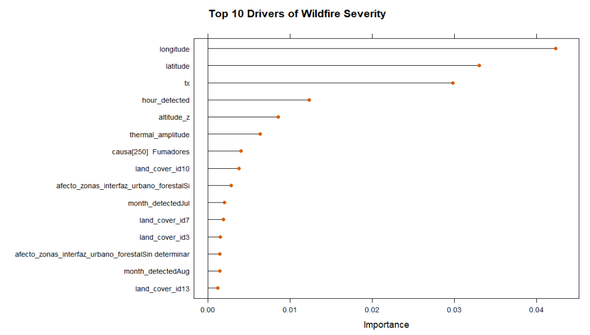

```{r setup, include = FALSE}
knitr::opts_chunk$set(echo = FALSE, message = FALSE, warning = FALSE)
```

```{r warning=FALSE, message=FALSE}
# 1. packages import
knitr::opts_chunk$set(echo = FALSE, message = FALSE, warning = FALSE)
library(tidyverse)
library(nanoparquet)
library(here)
library(scales)
library(naniar) 
library(skimr) 
library(patchwork)
library(VIM)
library(gt)
library(purrr)
library(forcats)
library(ggplot2)
library(tidyr)
library(dplyr)
library(gridExtra)
library(leaflet)
library(dplyr)
library(crosstalk)
library(shiny)
library(shinydashboard)  
library(plotly)
library(dplyr)
library(tidyr)
library(corrplot)
library(caret)
library(ranger)
library(pROC)
library(tibble)
library(bslib)
library(bsicons)
# 2. Data Import
wfc_final2 <- read_csv(here("Data", "wfc_final2.csv"))

```

# Introduction: The fire challenge in Catalonia

Wildfires are one of the most significant environmental threats in Catalonia. As climate change intensifies and traditional land management fades, the Mediterranean landscape becomes increasingly vulnerable.

](images/incendis%20catalunya.jpg){width="100%"}

## The objectives of this visualization:

-   **Identify spatio-temporal patterns**: To understand not just when it burns, but where the recurrence is highest.

-   **Analyze meteorological drivers**: To evaluate how variables such as maximum temperature, thermal amplitude, and precipitation define the windows of opportunity for fire escalation.

-   **Correlate causes and landscape**: To see how human activity and land cover types interact to create risk.

-   **Bridge descriptive and predictive analysis**: To provide a visual foundation that justifies the variables used in our Random Forest predictive model.

"*Data is the first step toward effective prevention. By visualizing the past 25 years, we can better prepare for the next season.*"

```{r warning=FALSE, message=FALSE}
options(bslib.precompiled = FALSE)
total_fires <- nrow(wfc_final2)
total_area <- sum(wfc_final2$superficie_total_forestal, na.rm = TRUE)

layout_column_wrap(
  width = 1/2,
  value_box(
    title = "Total fires recorded",
    value = total_fires,
    showcase = bs_icon("fire"),
    theme = "danger"
  ),
  value_box(
    title = "Total thousand Ha burnt",
    value = paste0(round(total_area / 1000, 1), "k"),
    showcase = bs_icon("tree"),
    theme = "warning"
  )
)
```

# Chapter 1: The pulse of time (temporal analysis)

### Understanding 25 years of fire history {data-commentary-width="350"}

```{r warning=FALSE, message=FALSE, fig.height=7, fig.width=10}
# 2. Data Preparation
# 2.1. Yearly Data: Convert year to numeric to avoid factor errors in scales
yearly_counts <- wfc_final2 %>%
  count(year) %>%
  mutate(year = as.numeric(as.character(year)))

# 2.2. Monthly Data: Define chronological order for the factor
wfc_final2$month_detected <- factor(wfc_final2$month_detected, 
                                    levels = c("Jan", "Feb", "Mar", "Apr", "May", "Jun", 
                                               "Jul", "Aug", "Sep", "Oct", "Nov", "Dec"))

monthly_counts <- wfc_final2 %>%
  count(month_detected)

# 3. Create Plots

# Plot A: Yearly Evolution with Trend Line
p_year <- ggplot(yearly_counts, aes(x = year, y = n)) +
  # Add the trend line (Linear Regression)
  geom_smooth(method = "lm", color = "steelblue", linetype = "dashed", size = 0.8, se = FALSE) +
  # Keep the actual data points and lines
  geom_line(color = "darkred", size = 1) +
  geom_point(color = "darkred", size = 2) +
  # Force X-axis to show every single year vertically
  scale_x_continuous(breaks = seq(min(yearly_counts$year), max(yearly_counts$year), by = 1)) +
  theme_minimal() +
  labs(title = "Annual fire frequency evolution", 
       subtitle = "1998 - 2022 Historical series with linear trend",
       x = "Year", 
       y = "Number of fires") +
  theme(
    plot.title = element_text(size = 12, face = "bold"),
    axis.text.x = element_text(angle = 90, vjust = 0.5, hjust = 1) # Vertical labels
  )

# Plot B: Monthly Seasonality (Bar Chart)
p_month <- ggplot(monthly_counts, aes(x = month_detected, y = n, group = 1)) +
  geom_bar(stat = "identity", fill = "indianred3") +
  theme_minimal() +
  labs(title = "Monthly fire seasonality", 
       subtitle = "Aggregated frequency (1998-2022)",
       x = "Month", 
       y = "Number of fires") +
  theme(
    plot.title = element_text(size = 12, face = "bold"),
    axis.text.x = element_text(angle = 45, hjust = 1)
  )

# 4. Final Layout Assembly
# Side-by-side distribution using patchwork
final_temporal_plot <- p_year + p_month + 
  plot_annotation(
    title = 'Temporal analysis of wildfires in Catalonia',
    theme = theme(plot.title = element_text(size = 16, hjust = 0.5, face = "bold"))
  )

# 5. Display the result
print(final_temporal_plot)
```

To understand the current risk, we must look at the historical series (1998-2022). As shown in the annual wildfire summary table and the temporal plots:

-   **Interannual variability**: Wildfires in Catalonia are episodic. The table highlights that years like 1998 and 2012 are not just frequency peaks but true ecological disasters, with 20,992 ha and 15,026 ha burnt respectively.

-   **Frequency vs. severity:** By comparing the line chart with the table, we notice an interesting pattern: a high number of fires (like in 2005 with 894 ignitions) doesn't always correlate with the largest burnt area (5,495 ha). This discrepancy highlights that fire spread depends on a complex interaction of factors beyond mere ignition count.

-   **The seasonal double peak**: While the bar chart shows summer is the main threat, the secondary peak in March highlights the danger of winter fires.

-   **A slow descent**: The blue trend line in the plot, supported by the lower figures in the last decade of the table (e.g., 2018 or 2020), reflects a slight decrease in ignitions over time. This trend suggests that prevention measures are mitigating the increasing climatic risk.

### Detailed annual data

```{r}
# 1. Prepare the data
table_data <- wfc_final2 %>%
  group_by(year) %>%
  summarise(
    Total_Fires = n(),
    Total_Area_Ha = sum(superficie_total_forestal, na.rm = TRUE)
  ) %>%
  arrange(year)

# 2. Create the corrected gt table
fire_table <- table_data %>%
  gt() %>%
  tab_header(
    title = md("**Annual wildfire summary**"),
    subtitle = "Frequency and Burnt Surface (1998-2022)"
  ) %>%
  cols_label(
    year = "Year",
    Total_Fires = "Number of Fires",
    Total_Area_Ha = "Total Area (ha)"
  ) %>%
  fmt_number(
    columns = c(Total_Fires, Total_Area_Ha),
    decimals = 1,
    use_seps = TRUE
  ) %>%
  # Updated styling method
  tab_style(
    style = cell_fill(color = "#F9F9F9"),
    locations = cells_column_labels()
  ) %>%
  tab_options(
    table.width = pct(100),
    column_labels.font.weight = "bold"
  )

fire_table %>%
  tab_options(
    container.height = px(400), 
    container.overflow.y = TRUE 
  )

```

### Hourly ignitions and daily cycles

```{r fig.height=7, fig.width=10}
# 1. Preparació de les dades per hores
hourly_counts <- wfc_final2 %>%
  filter(!is.na(hour_detected)) %>%
  count(hour_detected)

# 2. Gràfic de barres horari
ggplot(hourly_counts, aes(x = hour_detected, y = n)) +
  geom_bar(stat = "identity", fill = "darkorange3", alpha = 0.8) +
  scale_x_continuous(breaks = 0:23) +
  theme_minimal() +
  labs(
    title = "Hourly distribution of fire ignitions",
    subtitle = "Daily patterns of fire detection (1998-2022)",
    x = "Hour of day (24h format)",
    y = "Number of fires"
  ) +
  theme(
    plot.title = element_text(size = 12, face = "bold"),
    panel.grid.minor = element_blank()
  )
```

The analysis of fire detection times reveals a significant **diurnal pattern** in wildfire activity across Catalonia. The frequency of ignitions remains minimal during the nocturnal and early morning hours (00:00 to 08:00), followed by a sharp increase that peaks during the central part of the day.

-   **Peak activity:** The maximum concentration of fire starts occurs between **12:00 and 17:00**, with a definitive peak at **16:00**. This window corresponds to the period of "maximum atmospheric receptivity," characterized by peak daily temperatures (TX) and the lowest relative humidity levels.

-   **Operational hypothesis:** This concentration during the solar peak suggests that most fires are detected when environmental conditions are most favorable for rapid spread. Ignitions during these hours face a higher risk of escaping initial suppression efforts, a factor that will be further explored in the predictive modeling stage to determine its real weight in fire severity.

-   **Anthropogenic influence:** The synchronization of the peak with daylight hours also suggests a strong correlation with human activity, including agricultural practices, forest visits, and transportation, which decrease drastically after sunset.

# Chapter 2: The core of the story (interactive exploration)

```{r}
wfc_final2 <- wfc_final2 %>%
  mutate(
    # Fem el canvi basant-nos en la fila (row_number())
    municipio = case_when(
      row_number() == 778 ~ "AGUILAR DE SEGARRA",
      row_number() == 779 ~ "CARDONA",
      row_number() == 2096 ~ "OLIVELLA",
      row_number() == 2386 ~ "LA SÈNIA",
      row_number() == 2919 ~ "VALLCLARA",
      row_number() == 3348 ~ "MONTMANEU",
      row_number() == 3516 ~ "TORDERA",
      row_number() == 3524 ~ "SENAN",
      row_number() == 4740 ~ "SERÒS",
      row_number() == 4793 ~ "MARGALEF",
      row_number() == 4797 ~ "CARDONA",
      row_number() == 6068 ~ "SANT SALVADOR DE TORROELLA",
      row_number() == 7287 ~ "CASTELLFOLLIT DE RIUBREGÓS",
      row_number() == 8810 ~ "EL PLA DE MANLLEU",
      TRUE ~ municipio 
    ),
    
    provincia = case_when(
      row_number() == 778 ~ "BARCELONA",
      row_number() == 779 ~ "BARCELONA",
      row_number() == 2096 ~ "BARCELONA",
      row_number() == 2386 ~ "TARRAGONA",
      row_number() == 2919 ~ "TARRAGONA",
      row_number() == 3348 ~ "BARCELONA",
      row_number() == 3516 ~ "BARCELONA",
      row_number() == 3524 ~ "TARRAGONA",
      row_number() == 4740 ~ "LLEIDA",
      row_number() == 4793 ~ "TARRAGONA",
      row_number() == 4797 ~ "BARCELONA",
      row_number() == 6068 ~ "BARCELONA",
      row_number() == 7287 ~ "BARCELONA",
      row_number() == 8810 ~ "TARRAGONA",
      TRUE ~ provincia
    ),
    
    county_clean = case_when(
      row_number() == 778 ~ "BAGES",
      row_number() == 779 ~ "BAGES",
      row_number() == 2096 ~ "GARRAF",
      row_number() == 2386 ~ "MONTSIÀ",
      row_number() == 2919 ~ "CONCA DE BARBERÀ",
      row_number() == 3348 ~ "ANOIA",
      row_number() == 3516 ~ "MARESME",
      row_number() == 3524 ~ "CONCA DE BARBERÀ",
      row_number() == 4740 ~ "SEGRIÀ",
      row_number() == 4793 ~ "PRIORAT",
      row_number() == 4797 ~ "BAGES",
      row_number() == 6068 ~ "BAGES",
      row_number() == 7287 ~ "ANOIA",
      row_number() == 8810 ~ "ALT CAMP",
      TRUE ~ county_clean
    )
  )
```

```{r}
# Creem el dataframe de referència (diccionari)
land_cover_lookup <- data.frame(
  land_cover_id = c(1, 2, 3, 4, 5, 6, 7, 8, 9, 10, 11, 12, 13, 14, 15, 16, 17, 18, 
                    19, 20, 21, 22, 23, 24, 25, 26, 27, 28, 29, 30, 31, 32, 33, 
                    34, 35, 36, 37, 38, 39, 40, 41, 0),
  land_cover_type = c(
    "Herbaceous crops", "Market gardens, nurseries and greenhouse crops", 
    "Vineyards", "Olive groves", "Other woody crops", "Crops in transformation", 
    "Dense coniferous forests", "Dense deciduous broadleaf forests", 
    "Dense sclerophyllous and laurel forests", "Shrubland", "Open coniferous forests", 
    "Open deciduous broadleaf forests", "Open sclerophyllous and laurel forests", 
    "Grasslands", "Riparian forest", "Bare forest soil", "Burnt areas", 
    "Rocky areas and scree", "Beaches", "Wetlands", "Urban core", 
    "Urban expansion", "Low-density urban areas", "Isolated buildings in rural areas", 
    "Isolated residential areas", "Green urban areas", "Industrial, commercial and/or service areas", 
    "Sports and leisure areas", "Mining extraction areas and/or landfills", 
    "Areas under transformation", "Road network", "Bare urban soil", 
    "Airport areas", "Railway network", "Port areas", "Reservoirs", 
    "Lakes and lagoons", "Watercourses", "Ponds", "Artificial canals", "Sea", "No data"
  )
)
# Comprovem que land_cover_id sigui numeric en ambdós costats
wfc_final2$land_cover_id <- as.numeric(as.character(wfc_final2$land_cover_id))

# Afegim la descripció
wfc_final2 <- wfc_final2 %>%
  left_join(land_cover_lookup, by = "land_cover_id")
```

```{r warning=FALSE, message=FALSE}
# INTERACTIVE MAP: SPATIAL IMPACT AND MAXIMUM TEMPERATURE (TX)

# 1. Data Preparation for Leaflet
wfc_map_data <- wfc_final2 %>%
  mutate(
    # Year must be numeric for the slider to function correctly
    year_num = as.numeric(as.character(year)),
    
    # Create the customized popup text including meteorological and fire data
    popup_text = paste0(
      "<div style='font-family: Arial; font-size: 12px;'>",
      "<b style='color: #8B0000;'>Municipality:</b> ", municipio, "<br>",
      "<strong>Year:</strong> ", year, "<br>",
      "<strong>Detected:</strong> ", date_detected, "<br>",
      "<strong>Extinguished:</strong> ", date_extinguished, "<br>",
      "<strong>Max Temp (TX):</strong> ", tx, "°C<br>",
      "<strong>Burnt Surface:</strong> ", superficie_total_forestal, " ha<br>",
      "<strong>Land Cover Type:</strong> ", land_cover_type, "<br>",
      "<strong>Cause:</strong> ", causa, 
      "</div>"
    )
  ) %>%
  # Select all necessary columns for the map and synchronization
  select(longitude, latitude, year_num, popup_text, superficie_total_forestal, 
         municipio, date_detected, date_extinguished, land_cover_type, tx)

# 2. Create SharedData object for crosstalk interactivity
sd <- SharedData$new(wfc_map_data)

# 3. Define color palette based on Maximum Temperature (TX)
# Using "YlOrRd" (Yellow-Orange-Red) to represent heat intensity
pal <- colorNumeric(
  palette = "YlOrRd",
  domain = wfc_map_data$tx
)

# 4. Interactive Layout with Slider and Map
bscols(
  widths = c(12),
  # Year range filter slider
  filter_slider(
    id = "year_slider", 
    label = "Slide to navigate through years (1998-2022):", 
    sharedData = sd, 
    column = ~year_num,
    step = 1,
    ticks = TRUE,
    sep = "", 
    width = "100%"
  ),
  # Leaflet map configuration
  leaflet(sd, width = "100%", height = 700) %>%
    addTiles() %>% 
    addProviderTiles(providers$OpenStreetMap) %>% 
    addCircleMarkers(
      lng = ~longitude, 
      lat = ~latitude,
      # Radius is scaled by the square root of the burnt area for better visualization
      radius = ~sqrt(superficie_total_forestal) + 3, 
      color = ~pal(tx), # Circle color reflects the max temperature of the fire day
      stroke = TRUE,
      weight = 1,
      fillOpacity = 0.8,
      popup = ~popup_text,
      label = ~paste0(municipio, " - ", superficie_total_forestal, " ha (", tx, "°C)")
    ) %>%
    # Add legend to interpret temperature colors
    addLegend(
      pal = pal, 
      values = wfc_map_data$tx, 
      title = "Max Temp (°C)", 
      position = "bottomright",
      labFormat = labelFormat(suffix = "°C")
    )
)
```

### Where does Catalonia burn?

This interactive map bridges the gap between raw data and territorial management:

-   **Regional pressure**: You can visually confirm the high density of events in the Barcelona Metropolitan Area and the Empordà.

-   **Magnitude vs. frequency**: Use the slider to see how certain years were dominated by many small fires, while others were defined by a few Large Forest Fires.

-   **Thermal intensity**: The color of the markers represents the maximum temperature ($TX$) recorded on the day of the ignition. A shift towards darker red tones indicates more extreme thermal conditions.

-   **Magnitude vs. temperature**: Generally, higher maximum temperatures correlate with larger burnt areas due to increased fuel aridity. However, this is not a universal rule; for instance, the La Jonquera fire in July 2012 reached 8,729.8 ha with a $TX$ of only 28.6°C, demonstrating that other factors can override temperature as the primary driver.

In addition to the interactive map, we have generated these bar charts to summarize the provinces and municipalities with the highest fire frequency and the most significant burnt area. This dual perspective allows us to distinguish between areas of high human or natural activity (frequency) and areas of high ecological vulnerability (burnt area).

```{r warning=FALSE, message=FALSE, fig.width=16, fig.height=12, out.width="100%"}
# 1. Preparació de dades (Top 10)
top_10_muni_freq <- wfc_final2 %>%
count(municipio) %>%
slice_max(n, n = 10)

top_10_muni_area <- wfc_final2 %>%
group_by(municipio) %>%
summarise(total_area = sum(superficie_total_forestal, na.rm = TRUE)) %>%
slice_max(total_area, n = 10)

area_provincia <- wfc_final2 %>%
group_by(provincia) %>%summarise(total_area = sum(superficie_total_forestal, na.rm = TRUE))

# Paleta de blaus
blue_palette <- c("#08306b", "#08519c", "#2171b5", "#4292c6")
# --- FUNCIÓ D'ESTIL PER A FORMAT GRAN ---
estil_tfm_gran <- function() {
  theme_minimal(base_family = "sans") +
  theme(
    # Títols més grans per a resolucions altes
    plot.title = element_text(face = "bold", size = 14, color = "#2c3e50", margin = margin(b = 12)),
    axis.title.x = element_text(size = 11, face = "italic"),
    axis.text.y = element_text(size = 11), 
    axis.text.x = element_text(size = 10),
    panel.grid.major.y = element_blank(),
    panel.grid.minor = element_blank(),
    # Marge dret generós per evitar que el text de les barres es talli
    plot.margin = margin(t = 15, r = 60, b = 15, l = 10) 
  )
}

# --- RE-GENERACIÓ DELS GRÀFICS AMB TEXT MÉS GRAN ---

p1 <- ggplot(wfc_final2, aes(y = reorder(provincia, provincia, function(x) length(x)), x = ..count..)) +
  geom_bar(fill = blue_palette[1], width = 0.7) +
  geom_text(stat='count', aes(label=..count..), hjust=-0.2, size=4.5, fontface="bold") +
  scale_x_continuous(expand = expansion(mult = c(0, 0.3))) +
  labs(title = "Fire frequency by province", y = NULL, x = "Number of fires") +
  estil_tfm_gran()

p2 <- ggplot(top_10_muni_freq, aes(y = reorder(municipio, n), x = n)) +
  geom_col(fill = blue_palette[2], width = 0.8) +
  geom_text(aes(label=n), hjust=-0.2, size=4.5, fontface="bold") +
  scale_x_continuous(expand = expansion(mult = c(0, 0.3))) +
  labs(title = "Top 10 municipalities (frequency)", y = NULL, x = "Number of fires") +
  estil_tfm_gran()

p3 <- ggplot(area_provincia, aes(y = reorder(provincia, total_area), x = total_area)) +
  geom_col(fill = blue_palette[3], width = 0.8) +
  geom_text(aes(label=comma(round(total_area))), hjust=-0.2, size=4.5, fontface="bold") +
  scale_x_continuous(labels = comma, expand = expansion(mult = c(0, 0.3))) +
  labs(title = "Burnt area by province", y = NULL, x = "Total area (ha)") +
  estil_tfm_gran()

p4 <- ggplot(top_10_muni_area, aes(y = reorder(municipio, total_area), x = total_area)) +
  geom_col(fill = blue_palette[4], width = 0.8) +
  geom_text(aes(label=comma(round(total_area))), hjust=-0.2, size=4.5, fontface="bold") +
  scale_x_continuous(labels = comma, expand = expansion(mult = c(0, 0.3))) +
  labs(title = "Top 10 municipalities (burnt area)", y = NULL, x = "Total area (ha)") +
  estil_tfm_gran()

# --- ENSAMBLATGE AMB PATCHWORK ---
final_plot_gran <- (p1 + p2) / (p3 + p4) + 
  plot_annotation(
    title = 'Spatial Impact Analysis: Frequency vs. Severity',
    subtitle = 'Historical distribution across Catalonia (1998-2022)',
    theme = theme(
      plot.title = element_text(size = 18, hjust = 0.5, face = "bold"),
      plot.subtitle = element_text(size = 14, hjust = 0.5, color = "grey40", margin = margin(b = 20))
    )
  )

print(final_plot_gran)
```

### Key insights from the spatial analysis

The comparison between frequency and severity reveals a clear decoupling of fire patterns in Catalonia:

-   **The "Urban-Wildland Interface" (WUI) paradox**: Barcelona leads both in frequency (5,821 fires) and total area (35,430 ha), but at the municipal level, the pattern changes. Terrassa is the municipality with the highest number of ignitions (210), likely due to its large perimeter in contact with forest areas (high human activity). However, it does not even appear in the "Top 10" of burnt area. This pattern could suggest that while ignitions are frequent near large urban centers, fire suppression might be more rapid and effective in these areas.

-   **High-intensity hotspots**: Contrastingly, Aguilar de Segarra leads the severity ranking with 12,515 ha burnt, despite not being a leader in frequency. This could indicate that this area is more susceptible to Large Wildfires, where a single event might cause more ecological damage than numerous small ignitions in the metropolitan area.

-   **Regional efficiency**: While Lleida has the lowest frequency and total burnt area among the four provinces, its municipalities like Artesa de Segre or Agramunt appear in the top severity list.

# Chapter 3: The geospatial dimension: Topography

## The altitude threshold: frequency vs. severity

The interaction between topography and wildfire dynamics in Catalonia reveals a distinct dual behavior when comparing fire frequency against fire severity.

```{r warning=FALSE, message=FALSE, fig.width=16, fig.height=12, out.width="100%"}
# 1. Frequency Plot (Improved aesthetics)
p1 <- wfc_final2 %>%
  filter(!is.na(altitude_z)) %>%
  ggplot(aes(x = altitude_z)) +
  geom_histogram(binwidth = 100, fill = "#2C3E50", color = "white", alpha = 0.85) +
  labs(
    title = "Fire frequency by altitude",
    subtitle = "Concentration of ignitions in lowlands",
    x = "Altitude (m)",
    y = "Number of fires"
  ) +
  theme_minimal(base_size = 14) +
  theme(
    plot.title = element_text(face = "bold", size = 16),
    panel.grid.minor = element_blank(),
    axis.title = element_text(face = "italic")
  )

# 2. Severity Plot (Clean & Professional)
p2 <- wfc_final2 %>%
  filter(!is.na(altitude_z)) %>%
  # Opcional: Filtrem valors extremadament petits per netejar el gràfic
  filter(superficie_total_forestal >= 0.01) %>% 
  ggplot(aes(x = altitude_z, y = superficie_total_forestal)) +
  geom_point(alpha = 0.15, color = "#7F8C8D", size = 1) + 
  geom_smooth(method = "gam", color = "#C0392B", fill = "#E6B0AA", size = 1.2) + 
  # Fixem els límits de l'eix Y (limits) i eliminem l'espai sobrant (expand)
  scale_y_log10(
    limits = c(0.01, 10000), 
    labels = scales::comma, 
    expand = c(0, 0)
  ) +
  labs(
    title = "Fire severity by altitude",
    subtitle = "Burnt area trend (log scale, >0.01 ha)",
    x = "Altitude (m)",
    y = "Burnt area (ha)"
  ) +
  theme_minimal(base_size = 14) +
  theme(
    plot.title = element_text(face = "bold", size = 16),
    panel.grid.minor = element_blank(),
    axis.title = element_text(face = "italic")
  )

# 3. Combine both plots side-by-side
# This is where magic happens with patchwork
combined_plot <- p1 + p2 + 
  plot_annotation(
    title = "Topographic analysis of wildfire patterns in Catalonia (1998-2022)",
    theme = theme(plot.title = element_text(size = 20, face = "bold", hjust = 0.5))
  )

# Display the result
combined_plot
```

### Fire frequency: The lowland pressure

The left panel (**Fire frequency by altitude**) demonstrates a heavy concentration of ignition events in the lowlands:

-   **Human-Wildland Interface**: Over 80% of ignitions occur below 600 meters. This concentration coincides with areas of higher population density, infrastructure, and agricultural activity, suggesting that human-caused ignitions (accidental or intentional) are the primary driver of fire frequency.

-   **The 1,000m barrier**: There is a sharp decline in the number of fires above 1,000 meters. This is likely due to shorter fire seasons in alpine environments, higher humidity levels, and significantly less human presence.

### Fire severity: The mid-altitude challenge

The right panel (**Fire severity by altitude**) provides a more complex perspective by analyzing the burnt area (log scale) across the same elevation gradient:

-   **Decoupling frequency from severity**: While most fires happen near sea level, the **GAM trend line** (red) shows that the average severity (burnt area) does not decrease linearly with altitude. Instead, it fluctuates and even peaks at mid-elevations (approx. 500m and 1,000m).

-   **The 1,000-meter peak**: A notable increase in the severity trend is observed around 1,000 meters. This peak suggests that when an ignition does occur at this altitude, it often involves more continuous forest fuels and more challenging topographic conditions for suppression, leading to larger burnt areas despite the lower frequency of events.

-   **Lower bound threshold**: By filtering events below 0.01 ha, we observe that "noise" from very small ignitions is mostly concentrated at low altitudes, whereas high-altitude events, though rarer, tend to have a higher "baseline" of severity.

# Chapter 4: The meteorological dimension

```{r warning=FALSE, message=FALSE, fig.height=7, fig.width=10}
# Gràfic de densitat: On es concentren els incendis segons Clima?
ggplot(wfc_final2, aes(x = tx, y = ppt)) +
  stat_density_2d(aes(fill = ..level..), geom = "polygon", color = "white") +
  geom_point(aes(size = superficie_total_forestal), alpha = 0.2, color = "orange") +
  scale_fill_viridis_c(option = "magma", name = "Density") +
  scale_size_continuous(range = c(1, 10), name = "Area (ha)") +
  theme_minimal() +
  labs(
    title = "Meteorological fingerprint of wildfires",
    subtitle = "Interaction between Max Temperature (TX) and Precipitation (PPT)",
    x = "Max Temperature (°C)",
    y = "Precipitation (mm)"
  )
```

### TX and PPT Interaction

The scatter plot and density analysis presented in the previous plot illustrate the climatic envelope in which wildfires occur in Catalonia. This "fingerprint" reveals a critical dependence on specific atmospheric conditions for fire spread and intensification.

-   **The zero-precipitation constraint**: A striking pattern is the extreme concentration of ignition events along the 0 mm precipitation line. The density heatmap (indicated by the lighter yellow tones) confirms that the vast majority of fires occur under conditions of absolute lack of immediate rainfall. This points to a strong inverse correlation between moisture availability and fire occurrence, indicating that recent precipitation may act as a critical limiting factor for ignition and subsequent spread.

-   **The thermal threshold for severity**: When observing the size of the points (representing **area in ha**), there is a clear shift as we move toward the right of the X-axis. Although fires are frequent between 15°C and 30°C, the **Large Wildfires**---represented by the largest bubbles---are almost exclusively clustered between **25°C and 40°C**. This thermal window represents the "danger zone" where suppression efforts face the greatest challenges.

-   **Atmospheric "Dry windows"**: There are occasional ignitions at higher precipitation levels (up to 60-70 mm), but these remain isolated, small-scale events (dots with almost no radius). This suggests that even if an ignition occurs during a rainy period, the lack of fuel continuity or the high fuel moisture content prevents the fire from gaining significant size.

-   **Operational implications**: The "Meteorological Fingerprint" suggests that the risk is not linear but threshold-based. Once precipitation reaches 0 mm and temperature crosses the 30°C mark, the landscape enters a state of high receptivity where any ignition has a high probability of becoming a high-impact event.

```{r warning=FALSE, message=FALSE, fig.height=7, fig.width=10}
# Evolució de la TX mitjana per any
climate_evolution <- wfc_final2 %>%
  group_by(year) %>%
  summarise(avg_tx = mean(tx, na.rm = TRUE))

ggplot(climate_evolution, aes(x = year, y = avg_tx)) +
  geom_line(color = "red", size = 1) +
  geom_point(size = 2) +
  geom_smooth(method = "lm", linetype = "dashed", color = "darkred") +
  theme_minimal() +
  labs(
    title = "Thermal evolution of fire days (1998-2022)",
    subtitle = "Annual average of TX during ignition events",
    x = "Year",
    y = "Average Maximum Temperature (°C)"
  )
```

### Temporal trends: the warming of fire days (1998-2022)

The historical evolution of the average maximum temperature (**TX**) during ignition events, as illustrated in the previous plot, provides a direct signal of climate change's influence on the regional fire regime.

-   **Positive linear trend**: The dashed regression line shows a steady upward trend over the 25-year period. This indicates that, on average, wildfires in Catalonia are occurring under increasingly hotter conditions. Even if the slope appears gradual, in ecological terms, a consistent rise in the thermal baseline significantly reduces fuel moisture and expands the annual "fire window."

-   **Interannual volatility**: The red line shows high variability, with extreme thermal peaks such as the one recorded in **2003** (surpassing 30°C on average)[@martinez2003]. This specific peak correlates with one of the most severe heatwaves in European history, which led to catastrophic wildfire seasons in the Mediterranean. Similar, though less extreme, peaks are visible in **2006**, **2009**, and more recently in the **2017-2020** period.

-   **A new thermal plateau**: It is noteworthy that since 2015, the annual average **TX** for fire days has rarely dropped below 26°C, whereas in the first decade of the series (1998-2008), values below 25°C were much more frequent. This suggests a "thermal hardening" of the environment, where the minimum conditions required for fire propagation are becoming more extreme.

-   **The confidence interval**: The grey shaded area (confidence interval) widening towards the end of the series reflects the increasing unpredictability and frequency of extreme events. While some years still show lower averages due to specific rainy summers, the overall trajectory is towards a hotter ignitions environment.

# Chapter 5: Land cover and ecosystem vulnerability

```{r fig.width=16, fig.height=12, out.width="100%"}
# 1. Preparació de dades 
land_cover_summary <- wfc_final2 %>%
  group_by(land_cover_type) %>%
  summarise(
    frequency = n(),
    total_area = sum(superficie_total_forestal, na.rm = TRUE)
  ) %>%
  filter(land_cover_type != "No data")

top_10_lc_freq <- land_cover_summary %>% slice_max(frequency, n = 10)
top_10_lc_area <- land_cover_summary %>% slice_max(total_area, n = 10)

# Paleta de colors verds
tree_color <- "#2d6a4f"
trunk_color <- "#606c38"

# 2. Funció d'estil per a format HORITZONTAL
estil_forestal_horiz <- function() {
  theme_minimal(base_family = "sans") +
  theme(
    plot.title = element_text(face = "bold", size = 14, color = "#1b4332"),
    axis.text.y = element_text(size = 11), 
    axis.text.x = element_text(size = 10),
    panel.grid.major.y = element_blank(),
    panel.grid.minor = element_blank(),
    plot.margin = margin(5, 20, 5, 5) 
  )
}

# --- GRÀFICS HORITZONTALS ---

# P5: Fire frequency by land cover type
p5 <- ggplot(top_10_lc_freq, aes(y = reorder(land_cover_type, frequency), x = frequency)) +
  geom_segment(aes(yend = reorder(land_cover_type, frequency), xend = 0), 
               color = trunk_color, size = 1.2) +
  geom_point(size = 7, color = tree_color) +
  geom_text(label = "🌲", size = 4, color = "white") +
  geom_text(aes(label = frequency), hjust = -0.6, size = 3.5, fontface = "bold", color = "#1b4332") +
  expand_limits(x = max(top_10_lc_freq$frequency) * 1.15) +
  labs(title = "Fire frequency by land cover type", y = NULL, x = "Number of fires") +
  estil_forestal_horiz()

# P6: Total burnt area by land cover type
p6 <- ggplot(top_10_lc_area, aes(y = reorder(land_cover_type, total_area), x = total_area)) +
  geom_segment(aes(yend = reorder(land_cover_type, total_area), xend = 0), 
               color = trunk_color, size = 1.2) +
  geom_point(size = 7, color = tree_color) +
  geom_text(label = "🌳", size = 4, color = "white") +
  # Etiqueta amb format de milers
  geom_text(aes(label = comma(round(total_area))), hjust = -0.4, size = 3.5, fontface = "bold", color = "#1b4332") +
  scale_x_continuous(labels = comma) +
  expand_limits(x = max(top_10_lc_area$total_area) * 1.2) +
  labs(title = "Total burnt area by land cover type", y = NULL, x = "Total area (ha)") +
  estil_forestal_horiz()

# 3. Unió final (un sota l'altre)
land_cover_tree_plot <- p5 / p6 + 
  plot_annotation(
    title = "Ecosystem Impact: Land cover analysis",
    subtitle = "Vegetation and soil types visualized as forest density (1998-2022)",
    theme = theme(plot.title = element_text(size = 18, hjust = 0.5, face = "bold", color = "#1b4332"))
  )

print(land_cover_tree_plot)
```

The analysis of wildfire impact across different land cover types reveals a critical duality between ignition frequency and landscape severity (total burnt area):

-   **Vulnerability of coniferous forests**: Dense coniferous forests exhibit the **highest fire frequency** with **3,250 recorded events**. This suggests a high susceptibility to ignition, likely due to the high flammability of resinous species.

-   **The herbaceous crop paradox**: While ranking third in frequency, Herbaceous crops represent the largest total burnt area, **exceeding 25,500 hectares**. This indicates that although fires may start less frequently in agricultural zones compared to forests, they tend to propagate much faster across open fields, affecting vast extensions in shorter timeframes.

-   **Shrublands as a constant threat**: Shrublands maintain a high-pressure profile in both metrics, ranking second in frequency (2,745) and second in burnt area (22,276 ha).

-   **Relative resilience of deciduous forests**: In contrast, dense deciduous broadleaf forests show significantly lower total burnt areas (7,661 ha). This may be attributed to higher fuel moisture retention and the lower flammability of broadleaf litter compared to needle-leaf species.

-   **Urban and infrastructure pressure**: The appearance of the Road network and Urban expansion in the burnt area rankings highlights the increasing risk at the Wildland-Urban Interface (WUI), where human activity acts as a primary driver of landscape transformation through fire.

# Chapter 6: Analysis of ignition sources and drivers

```{r fig.width=16, fig.height=12, out.width="100%"}
# 1. Preparació de dades de causes (Top 15)
causes_data <- wfc_final2 %>%
  group_by(causa) %>% 
  summarise(
    frequency = n(),
    total_area = sum(superficie_total_forestal, na.rm = TRUE)
  ) %>%
  filter(!is.na(causa) & causa != "No data")

# Seleccionem les 15 primeres per cada mètrica
top_15_causes_freq <- causes_data %>% slice_max(frequency, n = 10)
top_15_causes_area <- causes_data %>% slice_max(total_area, n = 10)

# 2. Paleta de colors "Fire" (taronges i vermells)
cause_palette <- c("#feb24c", "#fd8d3c", "#f03b20", "#bd0026")

# Funció d'estil optimitzada per a format horitzontal
estil_causes_tfm <- function() {
  theme_minimal(base_family = "sans") +
  theme(
    plot.title = element_text(face = "bold", size = 16, color = "#800026"),
    axis.text.y = element_text(size = 13), 
    axis.text.x = element_text(size = 12),
    panel.grid.major.y = element_blank(),
    plot.margin = margin(5, 20, 5, 5)
  )
}

# --- GRÀFICS HORITZONTALS ---

# P7: Top 15 Causes by Frequency
p7 <- ggplot(top_15_causes_freq, aes(y = reorder(causa, frequency), x = frequency)) +
  geom_col(fill = cause_palette[2], width = 0.7) +
  geom_text(aes(label = frequency), hjust = -0.2, size = 5, fontface = "bold") +
  expand_limits(x = max(top_15_causes_freq$frequency) * 1.2) +
  labs(title = "Top 10 fire causes by frequency", y = NULL, x = "Number of fires") +
  estil_causes_tfm()

# P8: Top 15 Causes by Burnt Area
p8 <- ggplot(top_15_causes_area, aes(y = reorder(causa, total_area), x = total_area)) +
  geom_col(fill = cause_palette[4], width = 0.7) +
  geom_text(aes(label = scales::comma(round(total_area))), hjust = -0.2, size = 5, fontface = "bold") +
  scale_x_continuous(labels = scales::comma) +
  expand_limits(x = max(top_15_causes_area$total_area) * 1.25) +
  labs(title = "Top 10 fire causes by burnt area", y = NULL, x = "Total area (ha)") +
  estil_causes_tfm()

# 3. Assemblea final (un sota l'altre)
causes_plot_final <- p7 / p8 + 
  plot_annotation(
    title = "Analysis of ignition sources",
    subtitle = "Top 10 most frequent and impactful causes (1998-2022)",
    theme = theme(plot.title = element_text(size = 20, hjust = 0.5, face = "bold", color = "#800026"))
  )

print(causes_plot_final)
```

The investigation into the origins of wildfires in Catalonia (1998-2022) reveals a landscape dominated by human activity, where the intent and negligence of individuals outweigh natural causes in both frequency and severity.

-   **The critical impact of arson**: The category "[400] Intencionado" is the primary driver of the fire problem in Catalonia. It not only records the highest frequency with **3,548 ignitions** but also results in the largest ecological footprint, accounting for **30,435 hectares burnt**.

-   **Negligence and infrastructure**: While intentional fires lead in severity, a significant portion of the total area is lost due to technical and human failures. "[320] Otras causas por líneas eléctricas" represents a major risk factor: although it is not in the top three for frequency, it ranks second in burnt area (**18,736 ha**).

-   **Smoking and public awareness**: The category "[250] Fumadores" remains a persistent threat, appearing prominently in both charts. With over **800 fires** and **14,255 hectares** destroyed, it underscores the ongoing need for public awareness campaigns regarding the disposal of cigarette butts, especially near road networks and forest interfaces.

-   **Natural vs. anthropogenic origins**: Lightning ("[100] Rayo") is the most frequent natural cause (**1,477 fires**). However, its impact on the total burnt area (**5,029 ha**) is considerably lower than that of intentional or negligent human acts. This confirms that wildfires in Catalonia are, fundamentally, a human-driven phenomenon.

-   **The challenge of uncertainty**: The high volume of "[500] Desconocida" cases (**1,809 ignitions**) points toward the difficulty of post-fire forensic investigation. Reducing this statistical "noise" is essential for improving targeted prevention measures.

### Behavioral drivers: A detailed analysis of arsonist motivations

```{r fig.width=16, fig.height=12, out.width="100%"}
# 1. Preparació de dades amb cerca parcial de text
motivacions_data <- wfc_final2 %>%
  # Busquem qualsevol registre que contingui la paraula "Intencionado" sense importar majúscules
  filter(grepl("Intencionado", causa, ignore.case = TRUE)) %>% 
  group_by(motivacion) %>%
  summarise(
    frequency = n(),
    total_area = sum(superficie_total_forestal, na.rm = TRUE)
  ) %>%
  # Eliminem valors buits o NAs que solen embrutar el gràfic
  filter(!is.na(motivacion) & motivacion != "" & motivacion != "Desconeguda" & motivacion != "n/a") %>%
  slice_max(frequency, n = 10)

# d'aquesta manera veuràs com es diu exactament la categoria dels intencionats.

# 3. El gràfic
ggplot(motivacions_data, aes(y = reorder(motivacion, frequency), x = frequency)) +
  geom_col(fill = "#800026", width = 0.7) + 
  # Augmentem la mida del número a la dreta de la barra (size = 5)
  geom_text(aes(label = frequency), 
            hjust = -0.2, 
            size = 5, 
            fontface = "bold", 
            color = "#800026") +
  # Apliquem el salt de línia automàtic a l'eix Y
  scale_y_discrete(labels = function(x) str_wrap(x, width = 50)) + 
  # Ampliem l'espai a la dreta per evitar que el número quedi tallat
  expand_limits(x = max(motivacions_data$frequency) * 1.25) +
  theme_minimal() +
  labs(
    title = "Analysis of arsonist motivations",
    subtitle = "Specific drivers within intentional fires",
    x = "Number of fires",
    y = NULL
  ) +
  # Ajustos globals de les mides del text del tema
  theme(
    plot.title = element_text(size = 18, face = "bold"),    # Títol principal
    plot.subtitle = element_text(size = 14),               # Subtítol
    axis.text.y = element_text(size = 12, color = "black"), # Etiquetes de l'eix Y (motivacions)
    axis.text.x = element_text(size = 11),                 # Números de l'eix X
    axis.title.x = element_text(size = 13, margin = margin(t = 10)), # Títol eix X
    plot.margin = margin(10, 30, 10, 10)                   # Marge dret extra
  )
```

To refine the prevention strategies against intentional fires, it is essential to deconstruct the specific motivations behind the "[400] Intencionado" category. As shown in the previous plot, the breakdown of motivations provides a complex socio-behavioral map of wildfire origins in Catalonia:

-   **The challenge of unknown intent**: The most frequent category is **"[400] Motivación desconocida"** with **1,270 cases**. This high volume underscores the inherent difficulty in fire investigation; while the intentionality is proven by the presence of multiple ignition points or accelerants, the specific underlying grievance or objective often remains elusive.

-   **Vandalism and mental health**: A critical finding is the high incidence of **"[482] Vandalismo" (897 fires)** and **"[483] Enfermos mentales / Pirómanos" (761 fires)**. Together, these two categories represent a significant portion of the total intentional ignitions.

-   **Traditional and socio-economic conflicts**: Although less frequent than vandalism, motivations linked to land use remain persistent. These include **agricultural practices ([401])**, **livestock management ([402])**, and **hunting interests ([411])**. These categories reflect a historical friction between traditional rural activities and modern forest conservation regulations, where fire is still used as a prohibited tool for landscape management.

-   **Atypical drivers**: The data also captures marginal but significant behaviors, such as **"[464] Venganzas"** (Revenge) and, interestingly, **"[471] Incendios para distraer a la policía"**. These indicators highlight that wildfires are occasionally used as instruments of social conflict or as tactical diversions for other criminal activities.

# Chapter 7: Predictive Modeling using Random Forest

## Regresion Random Forest

### Model architecture and objective

In this stage, a Random Forest regressor was implemented to quantify the predictive power of environmental and anthropogenic variables over fire severity (Burnt Area). Random Forest was selected due to its robustness against outliers and its ability to capture non-linear relationships, which are prevalent in wildfire dynamics.

```{r}
# 1. Feature Selection and Formatting
# FINAL MODEL DATASET SELECTION
wfc_model_final <- wfc_final2 %>%
  select(
    # Target (Change this based on your goal)
    superficie_total_forestal, 
    
    # Location
    altitude_z, latitude, longitude,
    
    # Meteorology
    tx, ppt, thermal_amplitude,
    
    # Time
    month_detected, hour_detected,
    
    # Land Cover & Risk
    land_cover_id, afecto_zonas_interfaz_urbano_forestal, 
    afecto_espacio_protegido, afecto_zar,
    
    # Context
    causa
  ) %>%
  # Convert to factors for Random Forest
  mutate(across(where(is.character), as.factor),
         land_cover_id = as.factor(land_cover_id),
         month_detected = as.factor(month_detected),
         # If hour_detected is numeric, we might keep it as is or factorize it
         hour_detected = as.numeric(hour_detected)) %>%
  drop_na()

# Apply Log1p transformation (log(x + 1)) to handle 0 values
wfc_model_final <- wfc_model_final %>%
  mutate(log_surface = log1p(superficie_total_forestal))

# Set seed for reproducibility
set.seed(123)

# Create the partition based on the target variable
train_index <- createDataPartition(wfc_model_final$log_surface, p = 0.8, list = FALSE)

# Generate sets
train_set <- wfc_model_final[train_index, ]
test_set  <- wfc_model_final[-train_index, ]


# Train the Random Forest model
# We predict 'log_surface' using all other columns in 'train_set'
rf_model <- ranger(
  formula         = log_surface ~ ., 
  data            = train_set %>% select(-superficie_total_forestal), # Exclude the original non-log surface
  num.trees       = 500,
  importance      = "permutation", # Important to analyze variable impact later
  seed            = 123
)

# Get importance
importance_values <- importance(rf_model)
importance_df <- data.frame(
  Variable = names(importance_values),
  Importance = importance_values
) %>% arrange(desc(Importance))

# 1. Creem el dataframe amb les dades de la teva regressió
regression_metrics <- tibble(
  Metric = c("R-squared (Test)", "R-squared (OOB)", "RMSE", "MAE"),
  Value = c(0.146, 0.158, 0.694, 0.377),
  Interpretation = c(
    "Proportion of variance explained (test set)",
    "Internal model validation estimate",
    "Root Mean Square Error (log-scale)",
    "Mean Absolute Error (log-scale)"
  )
)

# 2. Generem la taula gt
gt_regression_results <- regression_metrics %>%
  gt() %>%
  tab_header(
    title = "Random Forest Regression performance",
    subtitle = "Evaluation of burnt surface prediction (Log-transformed)"
  ) %>%
  cols_label(
    Metric = "Performance Metric",
    Value = "Value",
    Interpretation = "Analysis"
  ) %>%
  fmt_number(
    columns = Value,
    decimals = 3
  ) %>%
  tab_style(
    style = cell_text(weight = "bold"),
    locations = cells_body(columns = Metric)
  ) %>%
  tab_options(
    table.font.names = "Times New Roman",
    heading.title.font.size = px(20)
  )
# Visualització
gt_regression_results

# Predict on test set
predictions <- predict(rf_model, data = test_set)$predictions

# Calculate Performance Metrics (RMSE and R2)
#postResample(pred = predictions, obs = test_set$log_surface)
```

```{r fig.width=16, fig.height=7, fig.width=10}
# Plot importance
ggplot(importance_df, aes(x = reorder(Variable, Importance), y = Importance)) +
  geom_bar(stat = "identity", fill = "steelblue") +
  coord_flip() +
  theme_minimal() +
  labs(title = "Variable importance in wildfire surface prediction",
       x = "Predictors", y = "Importance (Permutation)")
```

## Model setup and performance metrics

To quantify the drivers of fire severity, a **Random Forest** regression model was developed using the `ranger` engine. The target variable, `superficie_total_forestal`, was transformed using a **log1p** function to normalize its highly skewed distribution and handle the high frequency of small-scale events.

The model evaluation on the test set yielded the following metrics:

-   **RMSE**: 0.694

-   **R-squared (**$R^2$): 0.146

-   **MAE**: 0.377

While an $R^2$ of **14,6%** might appear low in other disciplines, in wildfire science, it reflects the inherent complexity and "noise" of fire behavior. Predicting the final size of a fire at the moment of ignition is a major challenge, as it depends on dynamic factors not fully captured in static datasets, such as suppression efficiency, wind shifts, and fuel connectivity.

## Drivers of severity: variable importance analysis

The primary value of the model lies in its **Permutation Importance**, which identifies which factors most significantly influence the final burnt area:

-   **Geospatial predominance**: **Longitude** and **Latitude** are the top predictors. This suggests a strong spatial component in Catalonia, where specific geographic corridors are more prone to large-scale events due to persistent wind patterns or topographical funnels.

-   **The "WUI" and territorial context**: The high importance of **`afecto_zonas_interfaz_urbano_forestal`** (WUI) confirms that the proximity to human settlements are critical. Fires near urban interfaces are often more complex to manage, as resources must be split between forest suppression and structural protection.

-   **Topography and climate**: **`altitude_z`** and **`tx`** (Maximum Temperature) appear as key environmental drivers. Higher temperatures lower the fuel's ignition threshold, while altitude influences both vegetation type and accessibility for ground crews.

-   **Anthropogenic drivers**: The variable **`causa`** ranks significantly high, reinforcing the idea that intentionality or specific types of negligence (as seen in Chapter 6) are not just frequency issues but indicators of potentially more severe fires.

## Classification Random Forest

### From continuous to categorical: defining severity classes

While regression provides a continuous estimate of fire size, from a forest management and emergency response perspective, it is often more actionable to categorize fires based on their potential risk. Therefore, a second modeling stage was developed using a Random Forest Classifier.

To define the boundary between "Low" and "High" severity classes, the distribution of the historical record (1998-2022) was analyzed. Given that the dataset is heavily dominated by small ignitions (Median = 0.07 ha), a fixed threshold of 10 ha---often used in general literature---was discarded in favor of a data-driven approach.

The arithmetic mean (6.67 ha) was selected as the classification threshold. This decision is statistically justified as it isolates the top 3.6% of events (525 fires), which represent the fires that deviate significantly from the central tendency and account for the vast majority of the total burnt area in Catalonia.

```{r}
# Creem la classe binària (Severity)
#wfc_model_final$severity <- as.factor(ifelse(wfc_model_final$superficie_total_forestal > 6.67, "High", "Low"))

# 1. Separació inicial (Hold-out)
#set.seed(123)
#train_index <- createDataPartition(wfc_model_final$severity, p = 0.8, list = FALSE)
#train_set <- wfc_model_final[train_index, ]
#test_set  <- wfc_model_final[-train_index, ]

# 1. Afegim 'sampling = "down"' al trainControl
#fitControl <- trainControl(
#  method = "cv",
#  number = 10,
#  classProbs = TRUE,
#  summaryFunction = twoClassSummary,
#  savePredictions = "final",
#  sampling = "down" 
#)

#rf_final_model <- train(
#  severity ~ tx + ppt + thermal_amplitude + altitude_z + causa + land_cover_id + latitude + longitude + month_detected + hour_detected + #afecto_zonas_interfaz_urbano_forestal,
#  data = train_set,
#  method = "ranger",
#  trControl = fitControl,
#  metric = "ROC", 
#  importance = "permutation"
#)

# Prediccions sobre el test_set
#final_preds <- predict(rf_final_model, newdata = test_set)
#final_probs <- predict(rf_final_model, newdata = test_set, type = "prob")

# 1. Confusion Matrix (per a Kappa, Sensibilitat i Especificitat)
#conf_matrix <- confusionMatrix(final_preds, test_set$severity)
#print(conf_matrix)

# 2. AUC-ROC 
#roc_obj <- roc(test_set$severity, final_probs$High)
#auc_value <- auc(roc_obj)
#print(paste("AUC final del model:", auc_value))

# 1. Extraure la importància
#importancia_data <- varImp(rf_final_model, scale = FALSE)

# 2. Seleccionar només les 10 més importants
#plot(importancia_data, top = 15, main = "Top 10 drivers of wildfire severity", col = "#d95f02")
```

```{r}
# 1. Creem el dataframe amb les dades de la teva Confusion Matrix
classification_metrics <- tibble(
  Metric = c("AUC (Area Under Curve)", "Sensitivity (Recall)", "Specificity", 
             "Balanced Accuracy", "Accuracy", "Kappa"),
  Value = c(0.7459, 0.6731, 0.6847, 0.6789, 0.6842, 0.0735),
  Interpretation = c("Excellent discriminative capacity", "Ability to detect High Severity fires", 
                    "Ability to detect Low Severity fires", "Average of sensitivity and specificity", 
                    "Overall correct predictions", "Agreement above chance")
)

# 2. Generem la taula gt
gt_model_results <- classification_metrics %>%
  gt() %>%
  tab_header(
    title = "Random Forest classification performance",
    subtitle = "Evaluation of high severity fire prediction (> 6.67 ha)"
  ) %>%
  cols_label(
    Metric = "Performance metric",
    Value = "Value",
    Interpretation = "Analysis"
  ) %>%
  fmt_number(
    columns = Value,
    decimals = 4
  ) %>%
  tab_style(
    style = cell_text(weight = "bold"),
    locations = cells_body(columns = Metric)
  ) %>%
  tab_options(
    table.font.names = "Times New Roman",
    heading.title.font.size = px(20)
  )

# Visualització
gt_model_results
```

```{r, echo=FALSE, out.width="100%", fig.align="center", fig.cap="Classification Model Performance: Confusion Matrix and Statistics"}
# Carreguem la llibreria per gestionar imatges
library(knitr)

# Inserim la imatge des de la subcarpeta images

```

## Model setup and performance metrics

The Random Forest classifier yielded a robust performance in predicting high-severity wildfire events (\>$6.67$ ha). The model achieved an AUC-ROC of 0.746, indicating a strong discriminative ability to distinguish between routine ignitions and significant fire events.

The results from the confusion matrix on the independent test set demonstrate a balanced predictive capacity:

-   **Sensitivity (recall): 67.3%**. The model successfully identifies two out of every three high-severity fires, which is a critical threshold for early warning and resource allocation.

-   **Specificity: 68.5%**. The model correctly filters out approximately $69\%$ of low-severity fires, maintaining a consistent performance across both classes.

-   **Balanced accuracy: 67.9%**. Given the extreme class imbalance (only $3.6\%$ prevalence of "High" severity), this metric confirms that the downsampling strategy effectively prevented the model from being biased toward the majority class.

## Drivers of severity: variable importance analysis

The variable importance analysis (permutation-based) reveals that **geospatial coordinates and climatic factors** are the primary drivers of fire severity in Catalonia:

1.  **Geographic gradient (longitude and latitude)**: These emerged as the most influential predictors. This suggests that specific regional patterns are fundamental in determining whether an ignition escalates into a large fire.

2.  **Meteorological conditions (`tx`)**: Maximum temperature ranks as the top climatic driver. This confirms the direct relationship between extreme heat episodes and the loss of suppression capacity.

3.  **Temporal and topographic factors**: The hour of detection (`hour_detected`) and altitude (`altitude_z`) also play significant roles. The importance of altitude aligns with our previous topographic analysis, highlighting mid-elevation zones as high-risk areas for fire spread.

4.  **Anthropogenic influence**: Interestingly, "Smokers" (`causa[250] Fumadores`) and proximity to the **Urban-Wildland Interface (WUI)** appear within the top 10 drivers, suggesting that human activity not only triggers fires but also influences the severity context, likely due to the complexity of extinguishing fires near populated areas.

# Discussion and conclusions

## Discussion: The dual nature of fire prediction

The implementation of a dual Random Forest approach (Regression and Classification) provides a comprehensive understanding of the wildfire regime in Catalonia. While the regression model highlights the continuous drivers of fire size, the classification model---centered on the data-driven threshold of **6.67 ha**---allows us to identify the specific conditions that lead to high-severity events.

The results validate that fire severity is a **multi-causal and spatially-dependent phenomenon**. The prominence of **Longitude and Latitude** as top predictors in the classification model suggests that the geographic context (topography, fuel continuity, and distance to the coast) acts as a foundational risk layer. This spatial backbone is then "activated" by meteorological triggers, primarily **Maximum Temperature (TX)**, which emerged as the most critical climatic engine in both models.

A key finding is the relatively low importance of **Precipitation (PPT)** compared to thermal stress and location. This suggests that, in the Mediterranean context, the immediate flammability caused by heat peaks and the geographic layout are more decisive at the moment of ignition than recent rainfall patterns. Furthermore, the inclusion of **"Smokers"** and the **Urban-Wildland Interface (WUI)** in the top drivers highlights the undeniable anthropogenic footprint on fire severity, where human activity not only increases ignition probability but also complicates suppression efforts in high-risk zones.

## Conclusions

This study successfully demonstrates that machine learning, specifically the Random Forest algorithm, can effectively navigate the high noise and complexity of wildfire data. The main conclusions are summarized as follows:

1.  **Predictive robustness**: The classification model achieved a solid **AUC of 0.746**, with a **sensitivity of 67.3%**. This confirms that it is possible to anticipate two-thirds of high-severity fires using a combination of geographic, meteorological, and anthropogenic variables.

2.  **Geographic priority**: The high importance of coordinates and altitude justifies the transition towards **spatialized forest management**. Resources should be strategically pre-positioned based on these identified geographic risk corridors rather than relying on uniform seasonal trends.

3.  **Threshold significance**: Moving away from arbitrary thresholds to a data-driven mean of **6.67 ha** proved essential for model stability. This threshold effectively isolates the **top 3.6% of fires**, which are responsible for the majority of the ecological and structural damage in Catalonia.

# References
