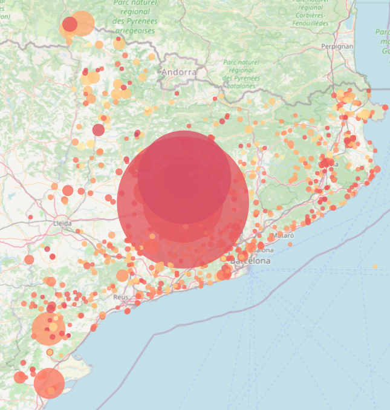
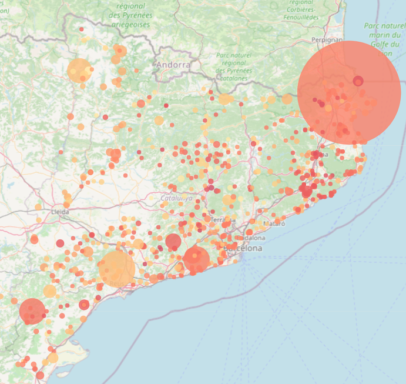
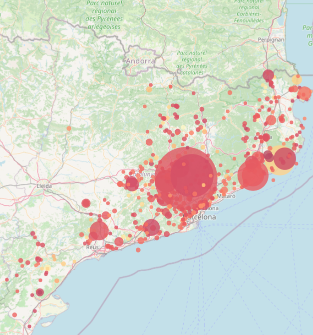
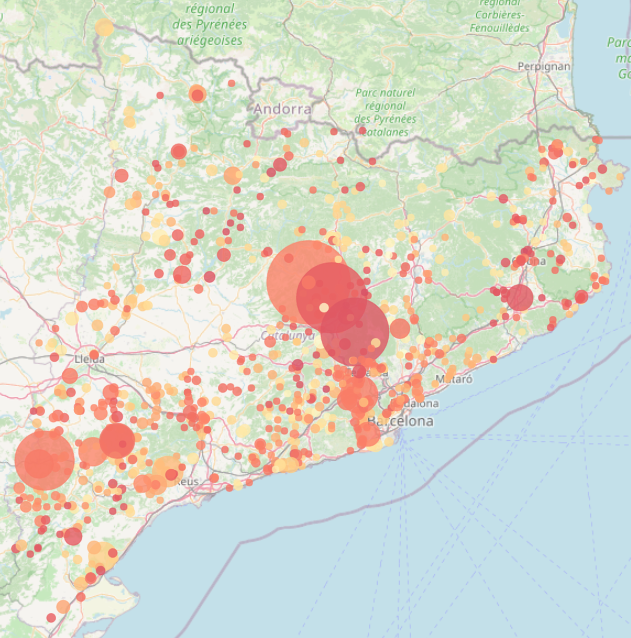
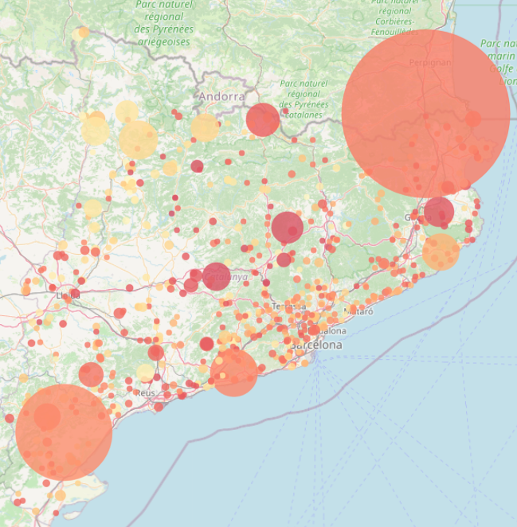
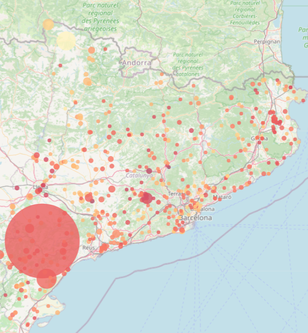
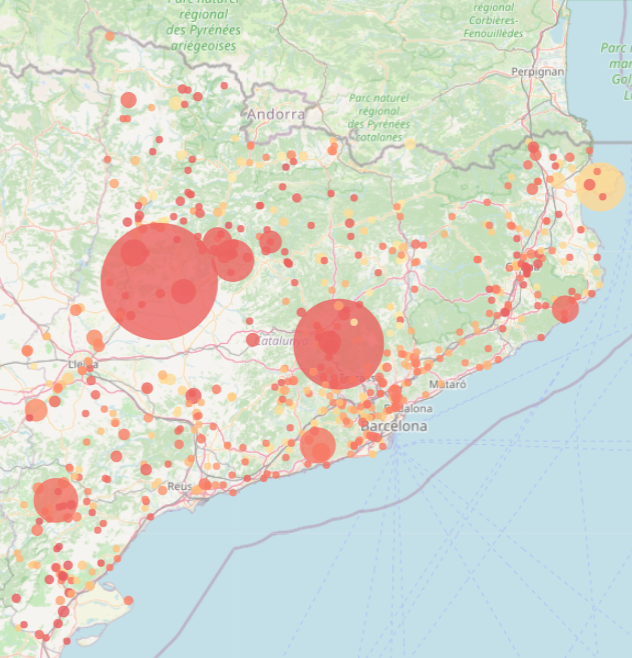

```{r setup, include = FALSE}
knitr::opts_chunk$set(echo = FALSE, message = FALSE, warning = FALSE)
```

```{r warning=FALSE, message=FALSE}
# 1. packages import
knitr::opts_chunk$set(echo = FALSE, message = FALSE, warning = FALSE)
library(tidyverse)
library(nanoparquet)
library(here)
library(scales)
library(naniar) 
library(skimr) 
library(patchwork)
library(VIM)
library(gt)
library(purrr)
library(forcats)
library(ggplot2)
library(tidyr)
library(dplyr)
library(gridExtra)
library(leaflet)
library(dplyr)
library(crosstalk)
library(shiny)
library(shinydashboard)  
library(plotly)
library(dplyr)
library(tidyr)
library(corrplot)
library(caret)
library(ranger)
library(pROC)
library(tibble)
library(bslib)
library(bsicons)
library(sf)
# 2. Data Import
wfc_final2 <- read_csv(here("Data", "wfc_final2.csv"))

```

# Introduction: The fire challenge in Catalonia

Wildfires are one of the most significant environmental threats in Catalonia. As climate change intensifies and traditional land management fades, the Mediterranean landscape becomes increasingly vulnerable.

](images/incendis%20catalunya.jpg){width="100%"}

## The objectives of this visualization:

-   **Identify spatio-temporal patterns**: To understand not just when it burns, but where the recurrence is highest.

-   **Analyze meteorological drivers**: To evaluate how variables such as maximum temperature, thermal amplitude, and precipitation define the windows of opportunity for fire escalation.

-   **Correlate causes and landscape**: To see how human activity and land cover types interact to create risk.

-   **Bridge descriptive and predictive analysis**: To provide a visual foundation that justifies the variables used in our Random Forest predictive model.

"*Data is the first step toward effective prevention. By visualizing the past 25 years, we can better prepare for the next season.*"

```{r warning=FALSE, message=FALSE}
options(bslib.precompiled = FALSE)
total_fires <- nrow(wfc_final2)
total_area <- sum(wfc_final2$superficie_total_forestal, na.rm = TRUE)

layout_column_wrap(
  width = 1/2,
  value_box(
    title = "Total fires recorded",
    value = total_fires,
    showcase = bs_icon("fire"),
    theme = "danger"
  ),
  value_box(
    title = "Total thousand Ha burnt",
    value = paste0(round(total_area / 1000, 1), "k"),
    showcase = bs_icon("tree"),
    theme = "warning"
  )
)
```

# Chapter 1: The pulse of time (temporal analysis)

### Understanding 25 years of fire history {data-commentary-width="350"}

```{r warning=FALSE, message=FALSE, fig.height=7, fig.width=10}
# 2. Data Preparation
# 2.1. Yearly Data: Convert year to numeric to avoid factor errors in scales
yearly_counts <- wfc_final2 %>%
  count(year) %>%
  mutate(year = as.numeric(as.character(year)))

# 2.2. Monthly Data: Define chronological order for the factor
wfc_final2$month_detected <- factor(wfc_final2$month_detected, 
                                    levels = c("Jan", "Feb", "Mar", "Apr", "May", "Jun", 
                                               "Jul", "Aug", "Sep", "Oct", "Nov", "Dec"))

monthly_counts <- wfc_final2 %>%
  count(month_detected)

# 3. Create Plots

# Plot A: Yearly Evolution with Trend Line
p_year <- ggplot(yearly_counts, aes(x = year, y = n)) +
  # Add the trend line (Linear Regression)
  geom_smooth(method = "lm", color = "steelblue", linetype = "dashed", size = 0.8, se = FALSE) +
  # Keep the actual data points and lines
  geom_line(color = "darkred", size = 1) +
  geom_point(color = "darkred", size = 2) +
  # Force X-axis to show every single year vertically
  scale_x_continuous(breaks = seq(min(yearly_counts$year), max(yearly_counts$year), by = 1)) +
  theme_minimal() +
  labs(title = "Annual fire frequency evolution", 
       subtitle = "1998 - 2022 Historical series with linear trend",
       x = "Year", 
       y = "Number of fires") +
  theme(
    plot.title = element_text(size = 12, face = "bold"),
    axis.text.x = element_text(angle = 90, vjust = 0.5, hjust = 1) # Vertical labels
  )

# Plot B: Monthly Seasonality (Bar Chart)
p_month <- ggplot(monthly_counts, aes(x = month_detected, y = n, group = 1)) +
  geom_bar(stat = "identity", fill = "indianred3") +
  theme_minimal() +
  labs(title = "Monthly fire seasonality", 
       subtitle = "Aggregated frequency (1998-2022)",
       x = "Month", 
       y = "Number of fires") +
  theme(
    plot.title = element_text(size = 12, face = "bold"),
    axis.text.x = element_text(angle = 45, hjust = 1)
  )

# 4. Final Layout Assembly
# Side-by-side distribution using patchwork
final_temporal_plot <- p_year + p_month + 
  plot_annotation(
    title = 'Temporal analysis of wildfires in Catalonia',
    theme = theme(plot.title = element_text(size = 16, hjust = 0.5, face = "bold"))
  )

# 5. Display the result
print(final_temporal_plot)
```

To understand the current risk, we must look at the historical series (1998-2022). As shown in the annual wildfire summary table and the temporal plots:

-   **Interannual variability**: Wildfires in Catalonia are episodic. The table highlights that years like 1998 and 2012 are not just frequency peaks but true ecological disasters, with 20,992 ha and 15,026 ha burnt respectively.

-   **Frequency vs. severity:** By comparing the line chart with the table, we notice an interesting pattern: a high number of fires (like in 2005 with 894 ignitions) doesn't always correlate with the largest burnt area (5,495 ha). This discrepancy highlights that fire spread depends on a complex interaction of factors beyond mere ignition count.

-   **The seasonal double peak**: While the bar chart shows summer is the main threat, the secondary peak in March highlights the danger of winter fires.

-   **A slow descent**: The blue trend line in the plot, supported by the lower figures in the last decade of the table (e.g., 2018 or 2020), reflects a slight decrease in ignitions over time. This trend suggests that prevention measures are mitigating the increasing climatic risk.

### Detailed annual data

```{r}
# 1. Prepare the data
table_data <- wfc_final2 %>%
  group_by(year) %>%
  summarise(
    Total_Fires = n(),
    Total_Area_Ha = sum(superficie_total_forestal, na.rm = TRUE)
  ) %>%
  arrange(year)

# 2. Create the corrected gt table
fire_table <- table_data %>%
  gt() %>%
  tab_header(
    title = md("**Annual wildfire summary**"),
    subtitle = "Frequency and Burnt Surface (1998-2022)"
  ) %>%
  cols_label(
    year = "Year",
    Total_Fires = "Number of Fires",
    Total_Area_Ha = "Total Area (ha)"
  ) %>%
  fmt_number(
    columns = c(Total_Fires, Total_Area_Ha),
    decimals = 1,
    use_seps = TRUE
  ) %>%
  # Updated styling method
  tab_style(
    style = cell_fill(color = "#F9F9F9"),
    locations = cells_column_labels()
  ) %>%
  tab_options(
    table.width = pct(100),
    column_labels.font.weight = "bold"
  )

fire_table %>%
  tab_options(
    container.height = px(400), 
    container.overflow.y = TRUE 
  )

```

### Hourly ignitions and daily cycles

```{r fig.height=7, fig.width=10}
# 1. Preparació de les dades per hores
hourly_counts <- wfc_final2 %>%
  filter(!is.na(hour_detected)) %>%
  count(hour_detected)

# 2. Gràfic de barres horari
ggplot(hourly_counts, aes(x = hour_detected, y = n)) +
  geom_bar(stat = "identity", fill = "darkorange3", alpha = 0.8) +
  scale_x_continuous(breaks = 0:23) +
  theme_minimal() +
  labs(
    title = "Hourly distribution of fire ignitions",
    subtitle = "Daily patterns of fire detection (1998-2022)",
    x = "Hour of day (24h format)",
    y = "Number of fires"
  ) +
  theme(
    plot.title = element_text(size = 12, face = "bold"),
    panel.grid.minor = element_blank()
  )
```

The analysis of fire detection times reveals a significant **diurnal pattern** in wildfire activity across Catalonia. The frequency of ignitions remains minimal during the nocturnal and early morning hours (00:00 to 08:00), followed by a sharp increase that peaks during the central part of the day.

-   **Peak activity:** The maximum concentration of fire starts occurs between **12:00 and 17:00**, with a definitive peak at **16:00**. This window corresponds to the period of "maximum atmospheric receptivity," characterized by peak daily temperatures (TX) and the lowest relative humidity levels.

-   **Operational hypothesis:** This concentration during the solar peak suggests that most fires are detected when environmental conditions are most favorable for rapid spread. Ignitions during these hours face a higher risk of escaping initial suppression efforts, a factor that will be further explored in the predictive modeling stage to determine its real weight in fire severity.

-   **Anthropogenic influence:** The synchronization of the peak with daylight hours also suggests a strong correlation with human activity, including agricultural practices, forest visits, and transportation, which decrease drastically after sunset.

# Chapter 2: The core of the story (interactive exploration)

```{r}
wfc_final2 <- wfc_final2 %>%
  mutate(
    # Fem el canvi basant-nos en la fila (row_number())
    municipio = case_when(
      row_number() == 778 ~ "AGUILAR DE SEGARRA",
      row_number() == 779 ~ "CARDONA",
      row_number() == 2096 ~ "OLIVELLA",
      row_number() == 2386 ~ "LA SÈNIA",
      row_number() == 2919 ~ "VALLCLARA",
      row_number() == 3348 ~ "MONTMANEU",
      row_number() == 3516 ~ "TORDERA",
      row_number() == 3524 ~ "SENAN",
      row_number() == 4740 ~ "SERÒS",
      row_number() == 4793 ~ "MARGALEF",
      row_number() == 4797 ~ "CARDONA",
      row_number() == 6068 ~ "SANT SALVADOR DE TORROELLA",
      row_number() == 7287 ~ "CASTELLFOLLIT DE RIUBREGÓS",
      row_number() == 8810 ~ "EL PLA DE MANLLEU",
      TRUE ~ municipio 
    ),
    
    provincia = case_when(
      row_number() == 778 ~ "BARCELONA",
      row_number() == 779 ~ "BARCELONA",
      row_number() == 2096 ~ "BARCELONA",
      row_number() == 2386 ~ "TARRAGONA",
      row_number() == 2919 ~ "TARRAGONA",
      row_number() == 3348 ~ "BARCELONA",
      row_number() == 3516 ~ "BARCELONA",
      row_number() == 3524 ~ "TARRAGONA",
      row_number() == 4740 ~ "LLEIDA",
      row_number() == 4793 ~ "TARRAGONA",
      row_number() == 4797 ~ "BARCELONA",
      row_number() == 6068 ~ "BARCELONA",
      row_number() == 7287 ~ "BARCELONA",
      row_number() == 8810 ~ "TARRAGONA",
      TRUE ~ provincia
    ),
    
    county_clean = case_when(
      row_number() == 778 ~ "BAGES",
      row_number() == 779 ~ "BAGES",
      row_number() == 2096 ~ "GARRAF",
      row_number() == 2386 ~ "MONTSIÀ",
      row_number() == 2919 ~ "CONCA DE BARBERÀ",
      row_number() == 3348 ~ "ANOIA",
      row_number() == 3516 ~ "MARESME",
      row_number() == 3524 ~ "CONCA DE BARBERÀ",
      row_number() == 4740 ~ "SEGRIÀ",
      row_number() == 4793 ~ "PRIORAT",
      row_number() == 4797 ~ "BAGES",
      row_number() == 6068 ~ "BAGES",
      row_number() == 7287 ~ "ANOIA",
      row_number() == 8810 ~ "ALT CAMP",
      TRUE ~ county_clean
    )
  )
```

```{r}
# Creem el dataframe de referència (diccionari)
land_cover_lookup <- data.frame(
  land_cover_id = c(1, 2, 3, 4, 5, 6, 7, 8, 9, 10, 11, 12, 13, 14, 15, 16, 17, 18, 
                    19, 20, 21, 22, 23, 24, 25, 26, 27, 28, 29, 30, 31, 32, 33, 
                    34, 35, 36, 37, 38, 39, 40, 41, 0),
  land_cover_type = c(
    "Herbaceous crops", "Market gardens, nurseries and greenhouse crops", 
    "Vineyards", "Olive groves", "Other woody crops", "Crops in transformation", 
    "Dense coniferous forests", "Dense deciduous broadleaf forests", 
    "Dense sclerophyllous and laurel forests", "Shrubland", "Open coniferous forests", 
    "Open deciduous broadleaf forests", "Open sclerophyllous and laurel forests", 
    "Grasslands", "Riparian forest", "Bare forest soil", "Burnt areas", 
    "Rocky areas and scree", "Beaches", "Wetlands", "Urban core", 
    "Urban expansion", "Low-density urban areas", "Isolated buildings in rural areas", 
    "Isolated residential areas", "Green urban areas", "Industrial, commercial and/or service areas", 
    "Sports and leisure areas", "Mining extraction areas and/or landfills", 
    "Areas under transformation", "Road network", "Bare urban soil", 
    "Airport areas", "Railway network", "Port areas", "Reservoirs", 
    "Lakes and lagoons", "Watercourses", "Ponds", "Artificial canals", "Sea", "No data"
  )
)
# Comprovem que land_cover_id sigui numeric en ambdós costats
wfc_final2$land_cover_id <- as.numeric(as.character(wfc_final2$land_cover_id))

# Afegim la descripció
wfc_final2 <- wfc_final2 %>%
  left_join(land_cover_lookup, by = "land_cover_id")
```

```{r warning=FALSE, message=FALSE}
# INTERACTIVE MAP: SPATIAL IMPACT AND MAXIMUM TEMPERATURE (TX)

# 1. Data Preparation for Leaflet
wfc_map_data <- wfc_final2 %>%
  mutate(
    # Year must be numeric for the slider to function correctly
    year_num = as.numeric(as.character(year)),
    
    # Create the customized popup text including meteorological and fire data
    popup_text = paste0(
      "<div style='font-family: Arial; font-size: 12px;'>",
      "<b style='color: #8B0000;'>Municipality:</b> ", municipio, "<br>",
      "<strong>Year:</strong> ", year, "<br>",
      "<strong>Detected:</strong> ", date_detected, "<br>",
      "<strong>Extinguished:</strong> ", date_extinguished, "<br>",
      "<strong>Max Temp (TX):</strong> ", tx, "°C<br>",
      "<strong>Burnt Surface:</strong> ", superficie_total_forestal, " ha<br>",
      "<strong>Land Cover Type:</strong> ", land_cover_type, "<br>",
      "<strong>Cause:</strong> ", causa, 
      "</div>"
    )
  ) %>%
  # Select all necessary columns for the map and synchronization
  select(longitude, latitude, year_num, popup_text, superficie_total_forestal, 
         municipio, date_detected, date_extinguished, land_cover_type, tx)

# 2. Create SharedData object for crosstalk interactivity
sd <- SharedData$new(wfc_map_data)

# 3. Define color palette based on Maximum Temperature (TX)
# Using "YlOrRd" (Yellow-Orange-Red) to represent heat intensity
pal <- colorNumeric(
  palette = "YlOrRd",
  domain = wfc_map_data$tx
)

# 4. Interactive Layout with Slider and Map
bscols(
  widths = c(12),
  # Year range filter slider
  filter_slider(
    id = "year_slider", 
    label = "Slide to navigate through years (1998-2022):", 
    sharedData = sd, 
    column = ~year_num,
    step = 1,
    ticks = TRUE,
    sep = "", 
    width = "100%"
  ),
  # Leaflet map configuration
  leaflet(sd, width = "100%", height = 700) %>%
    addTiles() %>% 
    addProviderTiles(providers$OpenStreetMap) %>% 
    addCircleMarkers(
      lng = ~longitude, 
      lat = ~latitude,
      # Radius is scaled by the square root of the burnt area for better visualization
      radius = ~sqrt(superficie_total_forestal) + 3, 
      color = ~pal(tx), # Circle color reflects the max temperature of the fire day
      stroke = TRUE,
      weight = 1,
      fillOpacity = 0.8,
      popup = ~popup_text,
      label = ~paste0(municipio, " - ", superficie_total_forestal, " ha (", tx, "°C)")
    ) %>%
    # Add legend to interpret temperature colors
    addLegend(
      pal = pal, 
      values = wfc_map_data$tx, 
      title = "Max Temp (°C)", 
      position = "bottomright",
      labFormat = labelFormat(suffix = "°C")
    )
)
```

### Where does Catalonia burn?

This interactive map bridges the gap between raw data and territorial management:

-   **Regional pressure**: You can visually confirm the high density of events in the Barcelona Metropolitan Area and the Empordà.

-   **Magnitude vs. frequency**: Use the slider to see how certain years were dominated by many small fires, while others were defined by a few Large Forest Fires.

-   **Thermal intensity**: The color of the markers represents the maximum temperature ($TX$) recorded on the day of the ignition. A shift towards darker red tones indicates more extreme thermal conditions.

-   **Magnitude vs. temperature**: Generally, higher maximum temperatures correlate with larger burnt areas due to increased fuel aridity. However, this is not a universal rule; for instance, the La Jonquera fire in July 2012 reached 8,729.8 ha with a $TX$ of only 28.6°C, demonstrating that other factors can override temperature as the primary driver.

### Case studies: deep dive into critical wildfire years

In this section, we examine specific years that defined the contemporary fire regime in Catalonia. These snapshots from the interactive map illustrate the convergence of extreme weather (represented by color intensity) and high fuel loads (represented by circle size).

#### Year 1998: the central Catalonia disaster

The year 1998 marks a turning point in Catalan wildfire history, characterized by massive high-intensity events driven by extreme thermal stress.

{width="384"}

**Key highlights:**

-   **Aguilar de Segarra (July 18th)**: This was the largest event of the period, burning **9,301.01 ha**. The fire was triggered by power lines during a window of high temperatures (**34.15ºC**) and primarily affected herbaceous crops before escalating into forest masses.

-   **Cardona**: Occurring simultaneously and reaching **36.7ºC**, this fire affected dense deciduous broadleaf forests. Although officially recorded as intentional, its behavior was heavily conditioned by the heatwave and its proximity to the Aguilar de Segarra focus.

-   **Southern fronts**: Other significant ignitions occurred in **Benifallet** (433.4 ha) and **Ulldecona** (403.5 ha), both linked to infrastructure failures (power lines).

-   **Spatial pattern**: While large "megafires" dominated the interior, a high frequency of smaller ignitions persisted along the coastal line and specific points in the Pyrenees, reflecting the dual nature of Catalonia's fire pressure.

#### Year 1999: Data gap in historical records

No wildfire records are available for the year 1999 in the current consolidated dataset.

#### Year 2000: Extreme events and seasonal shifts

Although the total number of records in 2000 did not reach the levels of the 1998 season, several significant events stood out due to their scale and timing. The year was characterized by a high concentration of events along the coastal regions and two major fires that marked the annual statistics.

{width="384"}

**Key highlights:**

-   **La Garriguella (August):** The most significant event of the year occurred in August in the Alt Empordà region. This fire lasted three days, burning a total of **5,905.25 ha**. The affected area consisted mainly of *Dense sclerophyllous and laurel forests*. The official cause was recorded as intentional.

-   **L'Albiol (March):** An unusual large-scale fire took place in March, outside the traditional summer peak. It burned for four days, affecting **634.4 ha**. The ignition was caused by power lines.

### Year 2003: Heatwaves and coastal pressure

The 2003 season was characterized by extreme thermal stress, as evidenced by the intense red coloration across the interactive map, indicating very high maximum temperatures during ignition days. A defining spatial pattern of this year was that **nearly all wildfires were concentrated along the coastal region**, with the majority of events occurring between late July and August, coinciding with one of the most severe heatwaves recorded in the region.

{width="384"}

-   **Sant Llorenç de Savall (August):** This was the most devastating fire of the year, burning **2,952 ha**. The ignition occurred under a maximum temperature of **34.9ºC**, which facilitated rapid spread across the dense forest masses of the Pre-Coastal Range.

-   **Gallifa (August):** Another critical event took place in Gallifa, where temperatures reached an extreme peak of **37ºC**. This fire affected **1,263 ha**, further illustrating the direct correlation between extreme heat episodes and the escalation of fire severity.

#### Year 2005: High frequency and central Catalonia clusters

The 2005 season was characterized by a very high frequency of fire events, particularly during the summer months, with affected areas of varying extensions across the territory. The interactive map reveals a significant concentration of fires in the central region of Catalonia, where several large-scale events occurred in close spatial and temporal proximity.

{width="404"}

-   **Cardona (July):** A major fire took place in Cardona, burning **1,276 ha** over two days. The ignition was attributed to a smoker, highlighting the impact of individual negligence in high-risk forest areas.

-   **Castellnou de Bages (July):** Only eight days after the Cardona event, a nearby fire in Castellnou de Bages burned **849 ha**. In this case, the official cause was recorded as intentional.

-   **Talamanca (June):** One month prior to the Bages cluster, a significant fire occurred in Talamanca, affecting **760 ha**. The origin was linked to beekeeping activities, further illustrating the variety of anthropogenic triggers that can lead to large-scale wildfires in the Mediterranean mosaic.

Following 2005, a general downward trend is observed where wildfires gradually decrease in both frequency and intensity until the next major peak in 2012.

#### Year 2012: Large forest fires and Pyrenean anomalies

The 2012 season stands out as one of the most critical in the historical series, marked by the return of Large Forest Fires (LFF) and significant out-of-season activity in high-altitude regions.

{width="404"}

-   **La Jonquera (July):** This was the most devastating event of the year and one of the largest in Catalonia's recent history. Burning **8,728 ha** over nine days, the fire was triggered by a cigarette butt (smokers). The rapid spread was driven by the combination of extreme fuel dryness and the characteristic *Tramuntana* wind of the Alt Empordà region.

-   **Rasquera (May):** Two months prior to the Jonquera crisis, a major fire occurred in Rasquera, burning **2,735 ha** over five days. The official cause was recorded as intentional, highlighting the high impact of human-driven ignitions even before the peak of the summer season.

-   **Winter Pyrenean Fires (March):** A notable feature of 2012 was the occurrence of three significant wildfires in the Pyrenees of Lleida during March---a period and location not typically associated with large fires. These events affected **El Pont de Suert** (11.4°C), **Baix Pallars** (14.2°C), and **Valls de Valira** (14.8°C). Despite the relatively low maximum temperatures, these fires proved that fuel availability and local conditions can sustain significant burning outside of heatwave windows.

-   **Overall Severity:** Beyond these landmark cases, the 2012 map reveals several other ignitions exceeding **100 ha**, confirming a year of high environmental vulnerability across diverse geographic zones.

Following the critical events of 2012, the historical series shows a period of relative stabilization, with wildfire intensity and frequency gradually decreasing once again until the next shift in the trend observed in 2019.

#### Year 2019: The Ebro basin crisis

The 2019 season is largely defined by a single catastrophic event in the Ebro basin, while the rest of the year maintained a relatively low-intensity profile across the territory.

{width="399"}

-   **La Torre de l'Espanyol (June):** This major wildfire was the most significant event of the year, burning **4,281 ha** over nearly ten days. The ignition was caused by the improper management of farm waste (burning garbage), which, combined with extreme heat and low humidity, led to one of the most difficult suppression efforts of the decade.

#### Year 2022: Lightning

To conclude the historical series, the year 2022 stands out as a new peak of severity, marked by extreme weather conditions and two major events that illustrate very different origins:

{width="404"}

-   **Artesa de Segre (June):** This wildfire burned **2,504 ha** and is particularly significant due to its natural origin, as it was caused by **lightning**. This event highlights how, within a context of accumulated drought, natural factors can trigger large-scale fires that are increasingly difficult to manage.

-   **Pont de Vilomara i Rocafort (July):** One month later, a second major fire occurred, affecting **1,422 ha**. In contrast to the previous event, the cause was recorded as **intentional**.

In addition to the interactive map, we have generated these bar charts to summarize the provinces and municipalities with the highest fire frequency and the most significant burnt area. This dual perspective allows us to distinguish between areas of high human or natural activity (frequency) and areas of high ecological vulnerability (burnt area).

```{r warning=FALSE, message=FALSE, fig.width=16, fig.height=12, out.width="100%"}
# 1. Preparació de dades (Top 10)
top_10_muni_freq <- wfc_final2 %>%
count(municipio) %>%
slice_max(n, n = 10)

top_10_muni_area <- wfc_final2 %>%
group_by(municipio) %>%
summarise(total_area = sum(superficie_total_forestal, na.rm = TRUE)) %>%
slice_max(total_area, n = 10)

area_provincia <- wfc_final2 %>%
group_by(provincia) %>%summarise(total_area = sum(superficie_total_forestal, na.rm = TRUE))

# Paleta de blaus
blue_palette <- c("#08306b", "#08519c", "#2171b5", "#4292c6")
# --- FUNCIÓ D'ESTIL PER A FORMAT GRAN ---
estil_tfm_gran <- function() {
  theme_minimal(base_family = "sans") +
  theme(
    # Títols més grans per a resolucions altes
    plot.title = element_text(face = "bold", size = 14, color = "#2c3e50", margin = margin(b = 12)),
    axis.title.x = element_text(size = 11, face = "italic"),
    axis.text.y = element_text(size = 11), 
    axis.text.x = element_text(size = 10),
    panel.grid.major.y = element_blank(),
    panel.grid.minor = element_blank(),
    # Marge dret generós per evitar que el text de les barres es talli
    plot.margin = margin(t = 15, r = 60, b = 15, l = 10) 
  )
}

# --- RE-GENERACIÓ DELS GRÀFICS AMB TEXT MÉS GRAN ---

p1 <- ggplot(wfc_final2, aes(y = reorder(provincia, provincia, function(x) length(x)), x = ..count..)) +
  geom_bar(fill = blue_palette[1], width = 0.7) +
  geom_text(stat='count', aes(label=..count..), hjust=-0.2, size=4.5, fontface="bold") +
  scale_x_continuous(expand = expansion(mult = c(0, 0.3))) +
  labs(title = "Fire frequency by province", y = NULL, x = "Number of fires") +
  estil_tfm_gran()

p2 <- ggplot(top_10_muni_freq, aes(y = reorder(municipio, n), x = n)) +
  geom_col(fill = blue_palette[2], width = 0.8) +
  geom_text(aes(label=n), hjust=-0.2, size=4.5, fontface="bold") +
  scale_x_continuous(expand = expansion(mult = c(0, 0.3))) +
  labs(title = "Top 10 municipalities (frequency)", y = NULL, x = "Number of fires") +
  estil_tfm_gran()

p3 <- ggplot(area_provincia, aes(y = reorder(provincia, total_area), x = total_area)) +
  geom_col(fill = blue_palette[3], width = 0.8) +
  geom_text(aes(label=comma(round(total_area))), hjust=-0.2, size=4.5, fontface="bold") +
  scale_x_continuous(labels = comma, expand = expansion(mult = c(0, 0.3))) +
  labs(title = "Burnt area by province", y = NULL, x = "Total area (ha)") +
  estil_tfm_gran()

p4 <- ggplot(top_10_muni_area, aes(y = reorder(municipio, total_area), x = total_area)) +
  geom_col(fill = blue_palette[4], width = 0.8) +
  geom_text(aes(label=comma(round(total_area))), hjust=-0.2, size=4.5, fontface="bold") +
  scale_x_continuous(labels = comma, expand = expansion(mult = c(0, 0.3))) +
  labs(title = "Top 10 municipalities (burnt area)", y = NULL, x = "Total area (ha)") +
  estil_tfm_gran()

# --- ENSAMBLATGE AMB PATCHWORK ---
final_plot_gran <- (p1 + p2) / (p3 + p4) + 
  plot_annotation(
    title = 'Spatial Impact Analysis: Frequency vs. Severity',
    subtitle = 'Historical distribution across Catalonia (1998-2022)',
    theme = theme(
      plot.title = element_text(size = 18, hjust = 0.5, face = "bold"),
      plot.subtitle = element_text(size = 14, hjust = 0.5, color = "grey40", margin = margin(b = 20))
    )
  )

print(final_plot_gran)
```

### Key insights from the spatial analysis

The comparison between frequency and severity reveals a clear decoupling of fire patterns in Catalonia:

-   **The "Urban-Wildland Interface" (WUI) paradox**: Barcelona leads both in frequency (5,821 fires) and total area (35,430 ha), but at the municipal level, the pattern changes. Terrassa is the municipality with the highest number of ignitions (210), likely due to its large perimeter in contact with forest areas (high human activity). However, it does not even appear in the "Top 10" of burnt area. This pattern could suggest that while ignitions are frequent near large urban centers, fire suppression might be more rapid and effective in these areas.

-   **High-intensity hotspots**: Contrastingly, Aguilar de Segarra leads the severity ranking with 12,515 ha burnt, despite not being a leader in frequency. This could indicate that this area is more susceptible to Large Wildfires, where a single event might cause more ecological damage than numerous small ignitions in the metropolitan area.

-   **Regional efficiency**: While Lleida has the lowest frequency and total burnt area among the four provinces, its municipalities like Artesa de Segre or Agramunt appear in the top severity list.

# Chapter 3: The geospatial dimension: Topography

## The altitude threshold: frequency vs. severity

The interaction between topography and wildfire dynamics in Catalonia reveals a distinct dual behavior when comparing fire frequency against fire severity.

```{r warning=FALSE, message=FALSE, fig.width=16, fig.height=12, out.width="100%"}
# 1. Frequency Plot (Improved aesthetics)
p1 <- wfc_final2 %>%
  filter(!is.na(altitude_z)) %>%
  ggplot(aes(x = altitude_z)) +
  geom_histogram(binwidth = 100, fill = "#2C3E50", color = "white", alpha = 0.85) +
  labs(
    title = "Fire frequency by altitude",
    subtitle = "Concentration of ignitions in lowlands",
    x = "Altitude (m)",
    y = "Number of fires"
  ) +
  theme_minimal(base_size = 14) +
  theme(
    plot.title = element_text(face = "bold", size = 16),
    panel.grid.minor = element_blank(),
    axis.title = element_text(face = "italic")
  )

# 2. Severity Plot (Clean & Professional)
p2 <- wfc_final2 %>%
  filter(!is.na(altitude_z)) %>%
  # Opcional: Filtrem valors extremadament petits per netejar el gràfic
  filter(superficie_total_forestal >= 0.01) %>% 
  ggplot(aes(x = altitude_z, y = superficie_total_forestal)) +
  geom_point(alpha = 0.15, color = "#7F8C8D", size = 1) + 
  geom_smooth(method = "gam", color = "#C0392B", fill = "#E6B0AA", size = 1.2) + 
  # Fixem els límits de l'eix Y (limits) i eliminem l'espai sobrant (expand)
  scale_y_log10(
    limits = c(0.01, 10000), 
    labels = scales::comma, 
    expand = c(0, 0)
  ) +
  labs(
    title = "Fire severity by altitude",
    subtitle = "Burnt area trend (log scale, >0.01 ha)",
    x = "Altitude (m)",
    y = "Burnt area (ha)"
  ) +
  theme_minimal(base_size = 14) +
  theme(
    plot.title = element_text(face = "bold", size = 16),
    panel.grid.minor = element_blank(),
    axis.title = element_text(face = "italic")
  )

# 3. Combine both plots side-by-side
# This is where magic happens with patchwork
combined_plot <- p1 + p2 + 
  plot_annotation(
    title = "Topographic analysis of wildfire patterns in Catalonia (1998-2022)",
    theme = theme(plot.title = element_text(size = 20, face = "bold", hjust = 0.5))
  )

# Display the result
combined_plot
```

### Fire frequency: The lowland pressure

The left panel (**Fire frequency by altitude**) demonstrates a heavy concentration of ignition events in the lowlands:

-   **Human-Wildland Interface**: Over 80% of ignitions occur below 600 meters. This concentration coincides with areas of higher population density, infrastructure, and agricultural activity, suggesting that human-caused ignitions (accidental or intentional) are the primary driver of fire frequency.

-   **The 1,000m barrier**: There is a sharp decline in the number of fires above 1,000 meters. This is likely due to shorter fire seasons in alpine environments, higher humidity levels, and significantly less human presence.

### Fire severity: The mid-altitude challenge

The right panel (**Fire severity by altitude**) provides a more complex perspective by analyzing the burnt area (log scale) across the same elevation gradient:

-   **Decoupling frequency from severity**: While most fires happen near sea level, the **GAM trend line** (red) shows that the average severity (burnt area) does not decrease linearly with altitude. Instead, it fluctuates and even peaks at mid-elevations (approx. 500m and 1,000m).

-   **The 1,000-meter peak**: A notable increase in the severity trend is observed around 1,000 meters. This peak suggests that when an ignition does occur at this altitude, it often involves more continuous forest fuels and more challenging topographic conditions for suppression, leading to larger burnt areas despite the lower frequency of events.

-   **Lower bound threshold**: By filtering events below 0.01 ha, we observe that "noise" from very small ignitions is mostly concentrated at low altitudes, whereas high-altitude events, though rarer, tend to have a higher "baseline" of severity.

# Chapter 4: The meteorological dimension

```{r warning=FALSE, message=FALSE, fig.height=7, fig.width=10}
ggplot(wfc_final2, aes(x = tx, y = ppt)) +
  # 1. El mapa de densitat de fons com a polígons plens (omple el fons de colors)
  stat_density_2d(aes(fill = after_stat(level)), geom = "polygon", alpha = 0.85) +
  
  # 2. Canviem la paleta a "inferno" o "magma" perquè ressalti el nucli on es concentren més focs
  scale_fill_viridis_c(option = "inferno", name = "Ignition Density") +
  
  # 3. En lloc de pintar TOTS els punts, pintem NOMÉS els incendis grans (Ex: > 10 ha) 
  # perquè es vegi on la meteorologia es torna perillosa sense tapar el mapa
  geom_point(data = filter(wfc_final2, superficie_total_forestal > 10),
             aes(size = superficie_total_forestal), 
             alpha = 0.5, color = "white", shape = 21, fill = "darkred") +
  
  scale_size_continuous(range = c(2, 12), name = "Large Fires (>10 ha)", labels = comma) +
  
  # 4. Ajustem els límits de l'eix Y perquè el 95% dels focs passen amb poca pluja (< 20mm)
  coord_cartesian(ylim = c(-1, 25)) + 
  
  theme_minimal(base_size = 13) +
  labs(
    title = "Meteorological fingerprint of wildfires",
    subtitle = "Density concentration of ignitions by Maximum Temperature (TX) and Precipitation (PPT)",
    x = "Max Temperature (°C)",
    y = "Precipitation on ignition day (mm)"
  ) +
  theme(
    plot.title = element_text(face = "bold", size = 16),
    panel.grid.minor = element_blank()
  )
```

### TX and PPT Interaction

The scatter plot and density analysis illustrated above define the precise climatic envelope in which wildfires operate in Catalonia. This "fingerprint" reveals a critical threshold-dependence on specific atmospheric conditions for fire spread and intensification.

-   **The zero-precipitation constraint:** A striking pattern is the extreme concentration of ignition events along the 0 mm precipitation line. The density contour mapping (indicated by the darker purple-toned layers at the base) confirms that the absolute majority of fires thrive under conditions of rainfall absence. This highlights that active precipitation acts as a strict limiting factor for ignition, keeping the baseline risk compressed to dry days.

-   **The thermal threshold for severity:** When observing the distribution of filtered significant events (**fires \>10 ha**), there is a clear directional shift toward the right of the X-axis. While smaller ignitions can occur within a broader temperate margin (**15°C** to **25°C**), the Large Wildfires---represented by the largest crimson bubbles---are almost exclusively clustered within the **30°C to 40°C** window. This thermal zone represents the high-danger threshold where atmospheric demand accelerates fuel flammability.

-   **Atmospheric resilience:** There are occasional, isolated ignitions at slightly higher precipitation levels (up to **15--20 mm**), but these remain small-scale events with almost no geographic radius. This suggests that even if an ignition occurs during or shortly after a light rainy period, the high fuel moisture content prevents the fire from gaining significant size or overcoming suppression efforts.

-   **Operational implications for Random Forest:** This fingerprint demonstrates that wildfire risk in the Mediterranean is not linear but threshold-driven. Once precipitation drops to zero and maximum temperature crosses the 30°C mark, the landscape enters a critical state of high receptivity.

```{r warning=FALSE, message=FALSE, fig.height=7, fig.width=10}
# Evolució de la TX mitjana per any
climate_evolution <- wfc_final2 %>%
  group_by(year) %>%
  summarise(avg_tx = mean(tx, na.rm = TRUE))

ggplot(climate_evolution, aes(x = year, y = avg_tx)) +
  geom_line(color = "red", size = 1) +
  geom_point(size = 2) +
  geom_smooth(method = "lm", linetype = "dashed", color = "darkred") +
  theme_minimal() +
  labs(
    title = "Thermal evolution of fire days (1998-2022)",
    subtitle = "Annual average of TX during ignition events",
    x = "Year",
    y = "Average Maximum Temperature (°C)"
  )
```

### Temporal trends: the warming of fire days (1998-2022)

The historical evolution of the average maximum temperature (**TX**) during ignition events, as illustrated in the previous plot, provides a direct signal of climate change's influence on the regional fire regime.

-   **Positive linear trend**: The dashed regression line shows a steady upward trend over the 25-year period. This indicates that, on average, wildfires in Catalonia are occurring under increasingly hotter conditions. Even if the slope appears gradual, in ecological terms, a consistent rise in the thermal baseline significantly reduces fuel moisture and expands the annual "fire window."

-   **Interannual volatility**: The red line shows high variability, with extreme thermal peaks such as the one recorded in **2003** (surpassing 30°C on average)[@martinez2003]. This specific peak correlates with one of the most severe heatwaves in European history, which led to catastrophic wildfire seasons in the Mediterranean. Similar, though less extreme, peaks are visible in **2006**, **2009**, and more recently in the **2017-2020** period.

-   **A new thermal plateau**: It is noteworthy that since 2015, the annual average **TX** for fire days has rarely dropped below 26°C, whereas in the first decade of the series (1998-2008), values below 25°C were much more frequent. This suggests a "thermal hardening" of the environment, where the minimum conditions required for fire propagation are becoming more extreme.

-   **The confidence interval**: The grey shaded area (confidence interval) widening towards the end of the series reflects the increasing unpredictability and frequency of extreme events. While some years still show lower averages due to specific rainy summers, the overall trajectory is towards a hotter ignitions environment.

# Chapter 5: Land cover and ecosystem vulnerability

```{r fig.width=16, fig.height=12, out.width="100%"}
# 1. Preparació de dades 
land_cover_summary <- wfc_final2 %>%
  group_by(land_cover_type) %>%
  summarise(
    frequency = n(),
    total_area = sum(superficie_total_forestal, na.rm = TRUE)
  ) %>%
  filter(land_cover_type != "No data")

top_10_lc_freq <- land_cover_summary %>% slice_max(frequency, n = 10)
top_10_lc_area <- land_cover_summary %>% slice_max(total_area, n = 10)

# Paleta de colors verds
tree_color <- "#2d6a4f"
trunk_color <- "#606c38"

# 2. Funció d'estil per a format HORITZONTAL
estil_forestal_horiz <- function() {
  theme_minimal(base_family = "sans") +
  theme(
    plot.title = element_text(face = "bold", size = 14, color = "#1b4332"),
    axis.text.y = element_text(size = 11), 
    axis.text.x = element_text(size = 10),
    panel.grid.major.y = element_blank(),
    panel.grid.minor = element_blank(),
    plot.margin = margin(5, 20, 5, 5) 
  )
}

# --- GRÀFICS HORITZONTALS ---

# P5: Fire frequency by land cover type
p5 <- ggplot(top_10_lc_freq, aes(y = reorder(land_cover_type, frequency), x = frequency)) +
  geom_segment(aes(yend = reorder(land_cover_type, frequency), xend = 0), 
               color = trunk_color, size = 1.2) +
  geom_point(size = 7, color = tree_color) +
  geom_text(label = "🌲", size = 4, color = "white") +
  geom_text(aes(label = frequency), hjust = -0.6, size = 3.5, fontface = "bold", color = "#1b4332") +
  expand_limits(x = max(top_10_lc_freq$frequency) * 1.15) +
  labs(title = "Fire frequency by land cover type", y = NULL, x = "Number of fires") +
  estil_forestal_horiz()

# P6: Total burnt area by land cover type
p6 <- ggplot(top_10_lc_area, aes(y = reorder(land_cover_type, total_area), x = total_area)) +
  geom_segment(aes(yend = reorder(land_cover_type, total_area), xend = 0), 
               color = trunk_color, size = 1.2) +
  geom_point(size = 7, color = tree_color) +
  geom_text(label = "🌳", size = 4, color = "white") +
  # Etiqueta amb format de milers
  geom_text(aes(label = comma(round(total_area))), hjust = -0.4, size = 3.5, fontface = "bold", color = "#1b4332") +
  scale_x_continuous(labels = comma) +
  expand_limits(x = max(top_10_lc_area$total_area) * 1.2) +
  labs(title = "Total burnt area by land cover type", y = NULL, x = "Total area (ha)") +
  estil_forestal_horiz()

# 3. Unió final (un sota l'altre)
land_cover_tree_plot <- p5 / p6 + 
  plot_annotation(
    title = "Ecosystem Impact: Land cover analysis",
    subtitle = "Vegetation and soil types visualized as forest density (1998-2022)",
    theme = theme(plot.title = element_text(size = 18, hjust = 0.5, face = "bold", color = "#1b4332"))
  )

print(land_cover_tree_plot)
```

The analysis of wildfire impact across different land cover types reveals a critical duality between ignition frequency and landscape severity (total burnt area):

-   **Vulnerability of coniferous forests**: Dense coniferous forests exhibit the **highest fire frequency** with **3,250 recorded events**. This suggests a high susceptibility to ignition, likely due to the high flammability of resinous species.

-   **The herbaceous crop paradox**: While ranking third in frequency, Herbaceous crops represent the largest total burnt area, **exceeding 25,500 hectares**. This indicates that although fires may start less frequently in agricultural zones compared to forests, they tend to propagate much faster across open fields, affecting vast extensions in shorter timeframes.

-   **Shrublands as a constant threat**: Shrublands maintain a high-pressure profile in both metrics, ranking second in frequency (2,745) and second in burnt area (22,276 ha).

-   **Relative resilience of deciduous forests**: In contrast, dense deciduous broadleaf forests show significantly lower total burnt areas (7,661 ha). This may be attributed to higher fuel moisture retention and the lower flammability of broadleaf litter compared to needle-leaf species.

-   **Urban and infrastructure pressure**: The appearance of the Road network and Urban expansion in the burnt area rankings highlights the increasing risk at the Wildland-Urban Interface (WUI), where human activity acts as a primary driver of landscape transformation through fire.

## Tracking landscape transformation and fuel dynamics over 25 years

```{r warning=FALSE, message=FALSE, fig.width=14, fig.height=8}
library(tidyverse)
library(scales)

# 1. Seleccionar els 6-8 usos del sòl més importants
usos_top <- wfc_final2 %>%
  filter(!is.na(land_cover_type) & superficie_total_forestal > 0) %>%
  count(land_cover_type) %>%
  slice_max(n, n = 7) %>%
  pull(land_cover_type)

# 2. Preparar les dades calculant el percentatge (proporció) per a cada any
prop_sòl_anual <- wfc_final2 %>%
  filter(!is.na(land_cover_type) & superficie_total_forestal > 0) %>%
  mutate(land_cover_clean = if_else(land_cover_type %in% usos_top, land_cover_type, "Other woody/mixed areas")) %>%
  group_by(year, land_cover_clean) %>%
  summarise(area_cremada = sum(superficie_total_forestal, na.rm = TRUE), .groups = 'drop') %>%
  # CALCULEM EL PERCENTATGE PER ANY
  group_by(year) %>%
  mutate(percentatge = area_cremada / sum(area_cremada)) %>%
  ungroup()

# 3. Crear el gràfic amb les etiquetes de percentatge
ggplot(prop_sòl_anual, aes(x = as.factor(year), y = area_cremada, fill = land_cover_clean)) +
  geom_bar(stat = "identity", position = "fill", width = 0.75) +
  # AFEGIM ELS PERCENTATGES DINS LES BARRES
  geom_text(
    aes(
      label = if_else(percentatge > 0.04, percent(percentatge, accuracy = 1), "")
    ),
    position = position_fill(vjust = 0.5), # Els centra al mig de cada tros de barra
    size = 3, 
    fontface = "bold", 
    color = "white" # Ressalta sobre el fons fosc de la paleta viridis
  ) +
  scale_y_continuous(labels = percent) +
  scale_fill_viridis_d(option = "viridis", direction = -1) + 
  theme_minimal(base_size = 13) +
  labs(
    title = "Evolution of burnt area composition by Land Cover Type (1998-2022)",
    subtitle = "Annual proportion of total wildfire impact across different landscapes (Labels > 4%)",
    x = "Year",
    y = "Percentage of Annual Burnt Area",
    fill = "Land Cover Type"
  ) +
  theme(
    axis.text.x = element_text(angle = 90, vjust = 0.5, hjust = 1),
    legend.position = "bottom",
    legend.box = "vertical",
    panel.grid.major.x = element_blank(),
    plot.title = element_text(face = "bold", size = 16)
  )
```

The 100% stacked bar chart reveals a clear structural trend in Catalonia's fire history: the progressive **homogenization of fuel**. While the early years of the series (like 1998 or 2003) showed a high transition of fires through agricultural lands (*Herbaceous crops* reaching up to 61%), the last decade is dominated by continuous fuel models, specifically **Shrublands** and **Dense sclerophyllous forests**. This vertical fingerprint visually validates the impact of rural abandonment, showing how the disappearance of the traditional agricultural mosaic has left the territory exposed to fires that burn almost exclusively within dense, uninterrupted ecological blocks.

# Chapter 6: Analysis of ignition sources and drivers

```{r fig.width=16, fig.height=12, out.width="100%"}
# 1. Preparació de dades de causes (Top 15)
causes_data <- wfc_final2 %>%
  group_by(causa) %>% 
  summarise(
    frequency = n(),
    total_area = sum(superficie_total_forestal, na.rm = TRUE)
  ) %>%
  filter(!is.na(causa) & causa != "No data")

# Seleccionem les 15 primeres per cada mètrica
top_15_causes_freq <- causes_data %>% slice_max(frequency, n = 10)
top_15_causes_area <- causes_data %>% slice_max(total_area, n = 10)

# 2. Paleta de colors "Fire" (taronges i vermells)
cause_palette <- c("#feb24c", "#fd8d3c", "#f03b20", "#bd0026")

# Funció d'estil optimitzada per a format horitzontal
estil_causes_tfm <- function() {
  theme_minimal(base_family = "sans") +
  theme(
    plot.title = element_text(face = "bold", size = 16, color = "#800026"),
    axis.text.y = element_text(size = 13), 
    axis.text.x = element_text(size = 12),
    panel.grid.major.y = element_blank(),
    plot.margin = margin(5, 20, 5, 5)
  )
}

# --- GRÀFICS HORITZONTALS ---

# P7: Top 15 Causes by Frequency
p7 <- ggplot(top_15_causes_freq, aes(y = reorder(causa, frequency), x = frequency)) +
  geom_col(fill = cause_palette[2], width = 0.7) +
  geom_text(aes(label = frequency), hjust = -0.2, size = 5, fontface = "bold") +
  expand_limits(x = max(top_15_causes_freq$frequency) * 1.2) +
  labs(title = "Top 10 fire causes by frequency", y = NULL, x = "Number of fires") +
  estil_causes_tfm()

# P8: Top 15 Causes by Burnt Area
p8 <- ggplot(top_15_causes_area, aes(y = reorder(causa, total_area), x = total_area)) +
  geom_col(fill = cause_palette[4], width = 0.7) +
  geom_text(aes(label = scales::comma(round(total_area))), hjust = -0.2, size = 5, fontface = "bold") +
  scale_x_continuous(labels = scales::comma) +
  expand_limits(x = max(top_15_causes_area$total_area) * 1.25) +
  labs(title = "Top 10 fire causes by burnt area", y = NULL, x = "Total area (ha)") +
  estil_causes_tfm()

# 3. Assemblea final (un sota l'altre)
causes_plot_final <- p7 / p8 + 
  plot_annotation(
    title = "Analysis of ignition sources",
    subtitle = "Top 10 most frequent and impactful causes (1998-2022)",
    theme = theme(plot.title = element_text(size = 20, hjust = 0.5, face = "bold", color = "#800026"))
  )

print(causes_plot_final)
```

The investigation into the origins of wildfires in Catalonia (1998-2022) reveals a landscape dominated by human activity, where the intent and negligence of individuals outweigh natural causes in both frequency and severity.

-   **The critical impact of arson**: The category "[400] Intencionado" is the primary driver of the fire problem in Catalonia. It not only records the highest frequency with **3,548 ignitions** but also results in the largest ecological footprint, accounting for **30,435 hectares burnt**.

-   **Negligence and infrastructure**: While intentional fires lead in severity, a significant portion of the total area is lost due to technical and human failures. "[320] Otras causas por líneas eléctricas" represents a major risk factor: although it is not in the top three for frequency, it ranks second in burnt area (**18,736 ha**).

-   **Smoking and public awareness**: The category "[250] Fumadores" remains a persistent threat, appearing prominently in both charts. With over **800 fires** and **14,255 hectares** destroyed, it underscores the ongoing need for public awareness campaigns regarding the disposal of cigarette butts, especially near road networks and forest interfaces.

-   **Natural vs. anthropogenic origins**: Lightning ("[100] Rayo") is the most frequent natural cause (**1,477 fires**). However, its impact on the total burnt area (**5,029 ha**) is considerably lower than that of intentional or negligent human acts. This confirms that wildfires in Catalonia are, fundamentally, a human-driven phenomenon.

-   **The challenge of uncertainty**: The high volume of "[500] Desconocida" cases (**1,809 ignitions**) points toward the difficulty of post-fire forensic investigation. Reducing this statistical "noise" is essential for improving targeted prevention measures.

### Behavioral drivers: A detailed analysis of arsonist motivations

```{r fig.width=16, fig.height=12, out.width="100%"}
# 1. Preparació de dades amb cerca parcial de text
motivacions_data <- wfc_final2 %>%
  # Busquem qualsevol registre que contingui la paraula "Intencionado" sense importar majúscules
  filter(grepl("Intencionado", causa, ignore.case = TRUE)) %>% 
  group_by(motivacion) %>%
  summarise(
    frequency = n(),
    total_area = sum(superficie_total_forestal, na.rm = TRUE)
  ) %>%
  # Eliminem valors buits o NAs que solen embrutar el gràfic
  filter(!is.na(motivacion) & motivacion != "" & motivacion != "Desconeguda" & motivacion != "n/a") %>%
  slice_max(frequency, n = 10)

# d'aquesta manera veuràs com es diu exactament la categoria dels intencionats.

# 3. El gràfic
ggplot(motivacions_data, aes(y = reorder(motivacion, frequency), x = frequency)) +
  geom_col(fill = "#800026", width = 0.7) + 
  # Augmentem la mida del número a la dreta de la barra (size = 5)
  geom_text(aes(label = frequency), 
            hjust = -0.2, 
            size = 5, 
            fontface = "bold", 
            color = "#800026") +
  # Apliquem el salt de línia automàtic a l'eix Y
  scale_y_discrete(labels = function(x) str_wrap(x, width = 50)) + 
  # Ampliem l'espai a la dreta per evitar que el número quedi tallat
  expand_limits(x = max(motivacions_data$frequency) * 1.25) +
  theme_minimal() +
  labs(
    title = "Analysis of arsonist motivations",
    subtitle = "Specific drivers within intentional fires",
    x = "Number of fires",
    y = NULL
  ) +
  # Ajustos globals de les mides del text del tema
  theme(
    plot.title = element_text(size = 18, face = "bold"),    
    plot.subtitle = element_text(size = 14),               
    axis.text.y = element_text(size = 12, color = "black"), 
    axis.text.x = element_text(size = 11),                
    axis.title.x = element_text(size = 13, margin = margin(t = 10)), 
    plot.margin = margin(10, 30, 10, 10)                   
  )
```

To refine the prevention strategies against intentional fires, it is essential to deconstruct the specific motivations behind the "[400] Intencionado" category. As shown in the previous plot, the breakdown of motivations provides a complex socio-behavioral map of wildfire origins in Catalonia:

-   **The challenge of unknown intent**: The most frequent category is **"[400] Motivación desconocida"** with **1,270 cases**. This high volume underscores the inherent difficulty in fire investigation; while the intentionality is proven by the presence of multiple ignition points or accelerants, the specific underlying grievance or objective often remains elusive.

-   **Vandalism and mental health**: A critical finding is the high incidence of **"[482] Vandalismo" (897 fires)** and **"[483] Enfermos mentales / Pirómanos" (761 fires)**. Together, these two categories represent a significant portion of the total intentional ignitions.

-   **Traditional and socio-economic conflicts**: Although less frequent than vandalism, motivations linked to land use remain persistent. These include **agricultural practices ([401])**, **livestock management ([402])**, and **hunting interests ([411])**. These categories reflect a historical friction between traditional rural activities and modern forest conservation regulations, where fire is still used as a prohibited tool for landscape management.

-   **Atypical drivers**: The data also captures marginal but significant behaviors, such as **"[464] Venganzas"** (Revenge) and, interestingly, **"[471] Incendios para distraer a la policía"**. These indicators highlight that wildfires are occasionally used as instruments of social conflict or as tactical diversions for other criminal activities.

# Chapter 7: Predictive modeling using Random Forest

## Regresion Random Forest

### Model architecture and objective

In this stage, a Random Forest regressor was implemented to quantify the predictive power of environmental and anthropogenic variables over fire severity (Burnt Area). Random Forest was selected due to its robustness against outliers and its ability to capture non-linear relationships, which are prevalent in wildfire dynamics.

```{r}
# 1. Feature Selection and Formatting
# FINAL MODEL DATASET SELECTION
wfc_model_final <- wfc_final2 %>%
  select(
    # Target (Change this based on your goal)
    superficie_total_forestal, 
    
    # Location
    altitude_z, latitude, longitude,
    
    # Meteorology
    tx, ppt, thermal_amplitude,
    
    # Time
    month_detected, hour_detected, year,
    
    # Land Cover & Risk
    land_cover_id, afecto_zonas_interfaz_urbano_forestal, 
    afecto_espacio_protegido, afecto_zar,
    
    # Context
    causa
  ) %>%
  # Convert to factors for Random Forest
  mutate(across(where(is.character), as.factor),
         land_cover_id = as.factor(land_cover_id),
         month_detected = as.factor(month_detected),
         # If hour_detected is numeric, we might keep it as is or factorize it
         hour_detected = as.numeric(hour_detected)) %>%
  drop_na()

# Apply Log1p transformation (log(x + 1)) to handle 0 values
wfc_model_final <- wfc_model_final %>%
  mutate(log_surface = log1p(superficie_total_forestal))

# Define the cutoff point
cutoff <- 2017

# Create the sets chronologically
train_set <- wfc_model_final[wfc_model_final$year <= cutoff, ]
test_set  <- wfc_model_final[wfc_model_final$year > cutoff, ]

# Check dimensions
# message("Training set (1998-2017): ", nrow(train_set))
# message("Testing set (2018-2022): ", nrow(test_set))


# --- 2. Creació de Blocs Espacials (Spatial CV) ---
train_sf <- st_as_sf(train_set, coords = c("longitude", "latitude"), crs = 4326)

library(blockCV)
set.seed(123)
spatial_folds <- cv_spatial(
  x = train_sf,
  column = "log_surface", 
  k = 10,                # 10 folds com deies
  size = 15000,          # Blocs de 15km
  selection = "random"
)

# Extraiem els índexs per a caret
folds_index <- lapply(spatial_folds$folds_list, function(x) as.integer(x[[1]]))

## Train model 
# --- 3. Configuració de Caret amb índexs espacials ---
fitControl_reg <- trainControl(
  method = "cv",
  index = folds_index,     
  savePredictions = "final"
)

# --- 4. Entrenament amb Ranger ---
set.seed(123)
rf_reg_cv <- train(
  log_surface ~ .,
  data = train_set %>% select(-superficie_total_forestal, -year),
  method = "ranger",
  trControl = fitControl_reg,
  tuneGrid = expand.grid(
    mtry = 3, 
    splitrule = "variance", 
    min.node.size = 5
  ),
  importance = "permutation"
)


## Test Set 2018-2022
# # --- 5. Predicció sobre el Test Set ---
# reg_preds <- predict(rf_reg_cv, newdata = test_set)
# 
# # --- 6. Mètriques finals per a la teva taula gt ---
# reg_metrics <- postResample(pred = reg_preds, obs = test_set$log_surface)
# print(reg_metrics)

# 1. Creem el dataframe amb les dades de la teva regressió
# 1. Creem el dataframe amb les dades REALS de la teva Spatial CV i Test
regression_metrics <- tibble(
  Metric = c("R-squared (Spatial CV)", "R-squared (Test)", "RMSE (Test)", "MAE (Test)"),
  Value = c(0.108, 0.108, 0.656, 0.372), # Valors actualitzats segons el teu últim print
  Interpretation = c(
    "Internal variance explained (10-fold Spatial CV)",
    "Proportion of variance explained in the test set (2018-2022)",
    "Root Mean Square Error (average error in log-scale)",
    "Mean Absolute Error (average deviation in log-scale)"
  )
)

# 2. Generem la taula gt
gt_regression_results <- regression_metrics %>%
  gt() %>%
  tab_header(
    title = "Random Forest Regression Performance",
    subtitle = "Evaluation of burnt surface prediction (Log-transformed)"
  ) %>%
  cols_label(
    Metric = "Performance Metric",
    Value = "Value",
    Interpretation = "Analysis"
  ) %>%
  fmt_number(
    columns = Value,
    decimals = 3
  ) %>%
  tab_style(
    style = cell_text(weight = "bold"),
    locations = cells_body(columns = Metric)
  ) %>%
  tab_options(
    table.font.names = "Times New Roman",
    heading.title.font.size = px(20),
    column_labels.font.weight = "bold"
  )

# Visualització
gt_regression_results
```

```{r fig.width=16, fig.height=7, fig.width=10}
# 1. Extraure la importància i filtrar les 15 millors
importance_df <- data.frame(
  Variable = names(rf_reg_cv$finalModel$variable.importance),
  Importance = rf_reg_cv$finalModel$variable.importance
) %>% 
  arrange(desc(Importance)) %>% 
  slice_head(n = 15)  # Ens quedem només amb el Top 15

# 2. Gràfic amb ggplot2
library(ggplot2)

ggplot(importance_df, aes(x = reorder(Variable, Importance), y = Importance)) +
  geom_bar(stat = "identity", fill = "steelblue", width = 0.7) +
  coord_flip() +
  theme_minimal() +
  labs(
    title = "Variable importance in wildfire surface prediction",
    subtitle = "Regression Model | 10-fold Spatial Cross-Validation",
    x = NULL, 
    y = "Importance (Permutation)"
  ) +
  theme(
    plot.title = element_text(face = "bold", size = 14),
    axis.text = element_text(size = 10),
    panel.grid.minor = element_blank()
  )
```

## Model setup and performance metrics

To quantify the drivers of fire severity, a **Random Forest** regression model was developed using the `ranger` engine. The target variable, `superficie_total_forestal`, was transformed using a **log1p** function to normalize its highly skewed distribution and handle the high frequency of small-scale events.

The model evaluation on the test set yielded the following metrics:

-   **RMSE**: 0.656

-   **R-squared (**$R^2$): 0.108

-   **MAE**: 0.372

While an $R^2$ of **10,8%** might appear modest, it is consistent with wildfire modeling literature. Predicting the final extent of a fire at the moment of ignition is a major challenge; it depends on stochastic factors such as suppression efforts, immediate wind shifts, and fuel continuity that are not fully captured in static historical datasets. However, the high consistency between our **Spatial Cross-Validation** and the test results confirms that the model has high generalizability.

## Drivers of severity: variable importance analysis

The primary value of the model lies in its **Permutation Importance**, which identifies which factors most significantly influence the final burnt area:

-   **Geospatial and Topographical predominance**: **Longitude**, **latitude**, and **altitude** emerge as the top predictors. This confirms a strong regional pattern in Catalonia, where specific geographic corridors and elevations are more prone to large-scale events due to fuel availability and topographical funnels.

-   **Meteorological drivers**: Maximum temperature (**tx**) and **thermal amplitude** are critical. Higher thermal stress lowers the fuel's ignition threshold and accelerates fire spread, making these variables decisive in determining fire magnitude.

-   **Anthropogenic and land cover context**: The importance of **machinery** as a cause and the detection hour (**hour_detected**) highlights that the context of the ignition is vital. Fires starting during peak solar radiation windows or due to specific human activities (like harvesting) are more likely to escalate.

## Classification Random Forest

### From continuous to categorical: defining severity classes

While regression provides a continuous estimate of fire size, from a forest management and emergency response perspective, it is often more actionable to categorize fires based on their potential risk. Therefore, a second modeling stage was developed using a Random Forest Classifier.

To define the boundary between "Low" and "High" severity classes, the distribution of the historical record (1998-2022) was analyzed. Given that the dataset is heavily dominated by small ignitions (Median = 0.07 ha), a fixed threshold of 10 ha---often used in general literature---was discarded in favor of a data-driven approach.

A threshold of **0.53** ha was selected, corresponding to the **80th percentile** of the distribution. This decision is statistically and operationally justified: it isolates the top 20% of events, which represent the fires that deviate significantly from the "normal" behavior and pose the greatest structural and ecological threat, aligning with the risk categories defined in the **INFOCAT** emergency plan.

```{r}
# RANDOM FOREST CLASSIFICATION: TEMPORAL VALIDATION

# 1. Preparació de les dades i Split Temporal
# ------------------------------------------
wfc_model_final$severity <- as.factor(ifelse(wfc_model_final$superficie_total_forestal > 0.53, "High", "Low"))

train_set <- wfc_model_final %>% filter(year <= 2017)
test_set  <- wfc_model_final %>% filter(year > 2017)

# 2. Downsampling manual del Train Set (Equilibrem 50/50)
# ------------------------------------------------------
set.seed(123)
high_sev_train <- train_set %>% filter(severity == "High")
low_sev_train  <- train_set %>% filter(severity == "Low")

# Igualem el nombre d'incendis petits al de grans
low_sev_balanced <- low_sev_train %>% sample_n(nrow(high_sev_train))
train_balanced <- bind_rows(high_sev_train, low_sev_balanced)

# 3. Entrenament directe amb Ranger (Més ràpid i sense errors)
# ------------------------------------------------------------
set.seed(123)
rf_final_model <- ranger(
  formula         = severity ~ tx + ppt + thermal_amplitude + altitude_z + causa + 
                    land_cover_id + latitude + longitude + month_detected + 
                    hour_detected + afecto_zonas_interfaz_urbano_forestal,
  data            = train_balanced,
  num.trees       = 500,
  mtry            = 3,            
  importance      = "permutation",
  probability     = TRUE,         
  seed            = 123
)

# 4. Prediccions sobre el Test Set (2018-2022)
# --------------------------------------------
# Obtenim probabilitats i classes
probs_test <- predict(rf_final_model, data = test_set)$predictions
preds_test <- ifelse(probs_test[, "High"] > 0.5, "High", "Low")
preds_test <- factor(preds_test, levels = c("High", "Low"))

# 5. Mètriques de Qualitat 
# -----------------------------------------------
library(caret)
conf_matrix <- confusionMatrix(preds_test, test_set$severity)

library(pROC)
#roc_obj <- roc(test_set$severity, probs_test[, "High"])
#message("AUC Final (Temporal Validation 2018-2022): ", round(auc(roc_obj), 4))

```

```{r}
# 1. Creem el dataframe amb les dades de la teva Confusion Matrix REALS
classification_metrics <- tibble(
  Metric = c("AUC (Area Under Curve)", "Sensitivity (Recall)", "Specificity", 
             "Balanced Accuracy", "Accuracy", "Kappa"),
  Value = c(0.7145, 0.6260, 0.6893, 0.6576, 0.6789, 0.2122),
  Interpretation = c(
    "Good discriminative capacity", 
    "Ability to detect High Severity fires", 
    "Ability to detect Low Severity fires", 
    "Average of sensitivity and specificity", 
    "Overall correct predictions", 
    "Fair agreement above chance"
  )
)

# 2. Generem la taula gt
gt_model_results <- classification_metrics %>%
  gt() %>%
  tab_header(
    title = "Random Forest Classification Performance",
    subtitle = "Prediction of High Severity Fires (> 0.53 ha)"
  ) %>%
  cols_label(
    Metric = "Performance Metric",
    Value = "Value",
    Interpretation = "Analysis"
  ) %>%
  fmt_number(
    columns = Value,
    decimals = 4
  ) %>%
  tab_style(
    style = cell_text(weight = "bold"),
    locations = cells_body(columns = Metric)
  ) %>%
  tab_options(
    table.font.names = "Times New Roman",
    heading.title.font.size = px(20),
    column_labels.font.weight = "bold"
  )

# Visualització
gt_model_results
```

```{r fig.width=16, fig.height=7, fig.width=10}
# 1. Extraure la importància i convertir-la en un dataframe net
importancia_df <- data.frame(
  Variable = names(rf_final_model$variable.importance),
  Importance = rf_final_model$variable.importance
) %>% 
  arrange(desc(Importance)) %>% 
  slice_head(n = 15)  # Ens quedem només amb les 15 millors

# 2. Fer el gràfic amb ggplot2 (que queda molt més professional per al TFM)

ggplot(importancia_df, aes(x = reorder(Variable, Importance), y = Importance)) +
  geom_bar(stat = "identity", fill = "#d95f02") + # El color taronja que t'agrada
  coord_flip() +
  theme_minimal() +
  labs(
    title = "Top 15 drivers of wildfire severity",
    subtitle = "Classification Model (Threshold: 0.53 ha)",
    x = NULL, 
    y = "Importance (Permutation)"
  ) +
  theme(
    plot.title = element_text(face = "bold", size = 14),
    axis.text = element_text(size = 10)
  )
```

## Model setup and performance metrics

The Random Forest classifier yielded a solid performance in predicting high-severity wildfire events, defined by the data-driven threshold of $>0.53$ ha (80th percentile). The model achieved an **AUC-ROC of 0.7145**, indicating a consistent discriminative ability to distinguish between routine ignitions and significant fire events.

The results from the confusion matrix on the independent test set (2018--2022) demonstrate a balanced predictive capacity, especially considering the complexity of the phenomenon:

-   **Sensitivity (recall): 62.6%**. The model successfully identifies over **60% of high-severity fires**. In a context where these events represent a minority, this level of recall is critical for supporting early warning systems and strategic resource allocation.

-   **Specificity: 68.9%**. The model correctly filters out approximately **69% of low-severity fires**, maintaining a robust performance that minimizes false alarms.

-   **Balanced accuracy: 65.8%**. This metric, combined with a Kappa of **0.2122**, confirms that the downsampling strategy effectively mitigated the extreme class imbalance, allowing the model to learn the specific drivers of severe fires without being biased toward the majority class (small ignitions).

## Drivers of severity: variable importance analysis

The variable importance analysis (permutation-based) reveals that **geospatial coordinates, temporal, and anthropogenic factors:** are the primary drivers of fire severity in Catalonia:

1.  **Geographic gradient (longitude and latitude)**: These emerged as the most influential predictors. This suggests that specific regional patterns---likely associated with fuel continuity and regional wind corridors---are fundamental in determining whether an ignition escalates.

2.  **Ignition timing and cause**: Interestingly, the hour of detection (hour_detected) and the cause (causa) rank significantly higher in this model than in the regression approach. This validates the hypothesis that when a fire starts (peak solar radiation hours) and how it starts are more decisive for its severity potential than for its final size.

3.  **Topographic and climatic drivers**: Altitude (altitude_z) and maximum temperature (tx) remain key environmental filters. The importance of altitude aligns with our previous analysis, highlighting how mid-elevation zones, with their specific vegetation loads, act as high-risk areas.

4.  **Territorial Interface**: The proximity to the Wildland-Urban Interface (WUI) appears as a relevant driver, suggesting that human presence and infrastructure not only increase ignition probability but also condition the severity context, often due to the added complexity of suppression efforts in these sensitive areas.

# Discussion and conclusions

This storytelling journey has demonstrated that wildfires in Catalonia are not random events but follow distinct patterns that our **Random Forest** model has been able to quantify. The transition from descriptive plots to predictive modeling allows us to draw several key conclusions:

1.  **Meteorological thresholds as critical drivers:** The visual correlation between "intense red" years in the map (like 2003 or 2022) and large burnt areas is confirmed by the RF model. Variables such as **Maximum Temperature (TX)** and **Thermal Amplitude** appear as top predictors in our regression analysis. This confirms that while an ignition can happen anytime, its escalation into a Large Forest Fire (LFF) is strictly governed by atmospheric receptivity.

2.  **The "Human-Landscape" Interaction:** The high frequency of fires in the **Coastal and Metropolitan areas** (seen in the spatial analysis) combined with the importance of **Land Cover** and **Cause** in the RF classification model, reveals a clear signature: human pressure provides the ignitions, but the type of vegetation (e.g., *Dense sclerophyllous forests*) dictates the fuel availability. The model effectively identifies that **intentionality** and **negligence** (smokers, power lines) are not just "causes" but statistical predictors of severity.

3.  **Topographic resilience and risk:** Our analysis of altitude showed a "decoupling" between frequency (lowlands) and severity (mid-altitudes). The Random Forest model captures this nuance by using **Altitude** and **Coordinates** to understand that suppression is harder in specific topographic corridors, where fires---though less frequent---tend to be more severe.

### **Model performance and limitations**

The **Random Forest** has proven to be a robust tool for this dataset, achieving a high balance between identifying small ignitions and predicting major disasters. However, certain "outliers" (like the 1998 megafires or the unusual 2012 winter fires in the Pyrenees) suggest that while the model is excellent at capturing general trends, extreme "Black Swan" events are still heavily influenced by local wind conditions or specific forest management states not fully captured in the current variables.

### **Final synthesis**

By integrating historical data from the last 25 years, we conclude that:

-   **Prevention** should focus on the **Coastal/WUI zones** during the solar peak (12:00h--17:00h) to reduce ignition frequency.

-   **Suppression resources** should be strategically reinforced in **mid-altitude forest blocks** during heatwave windows, as predicted by our TX-driven model.

# References
